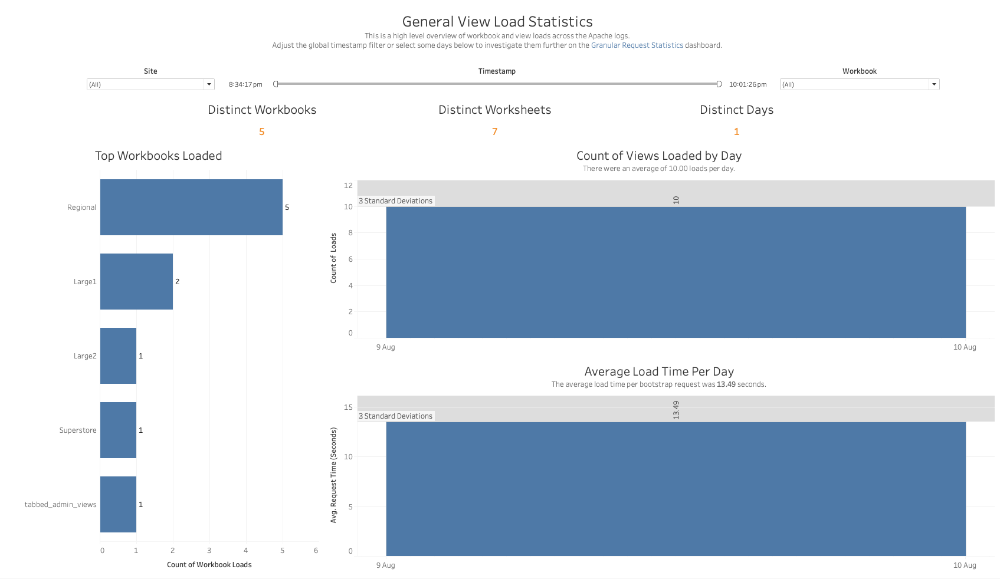
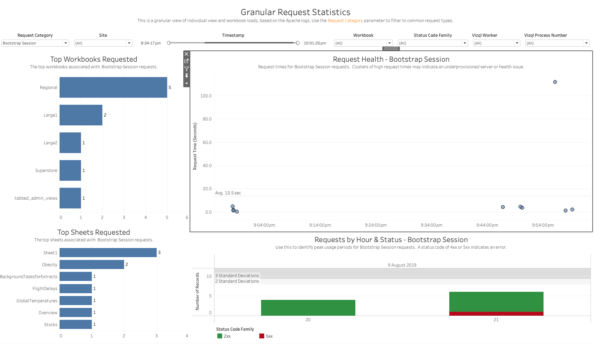
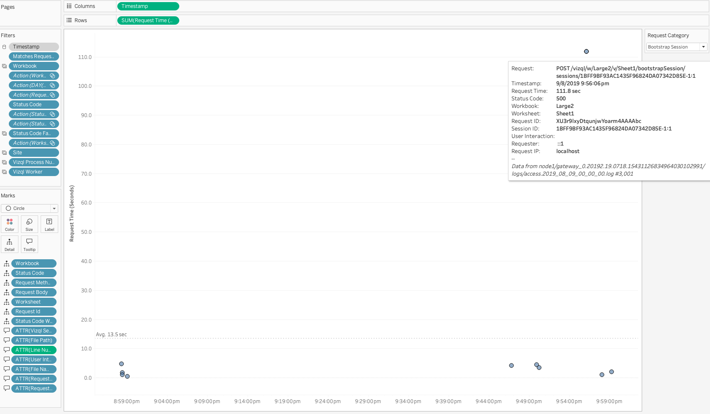
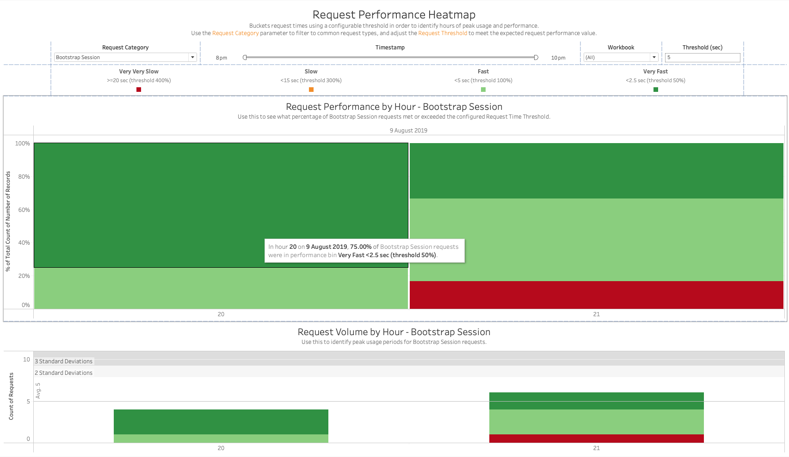
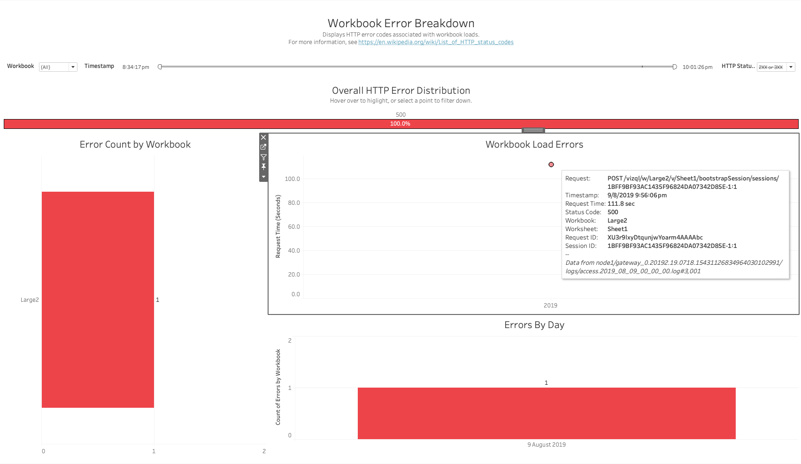
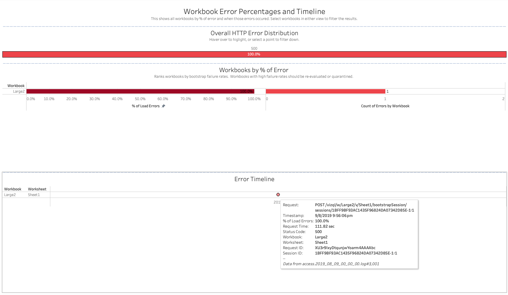

In this section:

* TOC
{:toc}

## What is it?
The Apache workbook (`Apache.twbx`) visualizes the HTTP access logs from Tableau Server's gateway (Apache) process. Every HTTP request that hits the gateway — a view load, a filter interaction, a bootstrap session, etc. — is logged here, along with which workbook/worksheet it targeted, how long it took to complete, and the HTTP status code it returned. Because the gateway sits in front of vizqlserver and other Tableau Server services, this workbook is a good starting point for getting an overall picture of web traffic, request performance, and HTTP-level errors across a deployment.

The Apache plugin only consumes the Apache access logs and writes them to a single `ApacheRequests` dataset. By default, gateway health check requests (`/favicon.ico`) are excluded from this dataset; set `PluginsConfiguration:Apache:IncludeGatewayChecks` to `true` in `LogSharkConfig.json` if you want those included.

## Glossary of Important Terms to Understand Apache Workbook Data and Dashboards

- **Request Category / Request Description**: A grouping of the raw request path into common request types, such as *Bootstrap Session* (the initial load of a view or dashboard) versus other user interactions (filter changes, categorical selections, etc.). Several dashboards let you filter down to a specific request category using a **Request Category** parameter.
- **Status Code Family**: The HTTP status code grouped by its leading digit (2xx, 4xx, 5xx, etc.). A status code of 4xx or 5xx indicates an error was returned to the client.
- **Vizql Worker / Vizql Process Number**: Identify which vizqlserver worker process on the server handled the request. These are useful for correlating an Apache request with log entries for that same request in the ART or vizqlserver logs on the same machine/process.
- **Request ID / Session ID**: The Request ID uniquely identifies a single HTTP request; the Session ID identifies the browser/client session the request belongs to (a session can span many requests). Both are useful for tracing a specific request or session across the ART workbook and the raw Tableau Server logs.

## When to use it?

- Get a quick, high-level pulse on Tableau Server web traffic — how many distinct workbooks and views are being loaded, and how often.
- Identify which workbooks are receiving the most traffic, or which ones are unusually slow to load.
- Identify hours or days where request performance degraded, and compare that against request volume for the same period.
- Investigate HTTP errors (4xx/5xx) returned to users — which workbooks and requests were involved, and when they occurred.
- Find workbooks with a disproportionately high error rate that may need to be re-evaluated or quarantined.
- Grab a Request ID or Session ID for a slow/failed request so you can cross-reference it in the ART workbook or the raw Tableau Server logs.

## How to use it?

### General View Load Statistics

This is a high-level overview of workbook and view loads across the Apache logs. Adjust the global timestamp filter or select some days to investigate them further on the Granular Request Statistics dashboard.

**Views:**
- ***Distinct Workbooks / Distinct Worksheets / Distinct Days***: Summary counts for the current filter selection.
- ***Top Workbooks Loaded***: A bar chart showing which workbooks had the most view loads.
- ***Count of Views Loaded by Day***: A bar chart of view load volume per day, with a 3-standard-deviation reference band to flag unusually high or low days.
- ***Average Load Time Per Day***: A bar chart of the average request time (in seconds) per day, with a 3-standard-deviation reference band.

**Filters:**
- Site dropdown
- Timestamp range filter
- Workbook dropdown

**Use Cases:**
- Quickly gauge which workbooks are seeing the most traffic.
- Spot anomalous days with unusually high/low view load counts or average load times.
- Use the timestamp filter to narrow to a day of interest, then jump to the Granular Request Statistics dashboard to investigate individual requests from that period.

### Granular Request Statistics

This is a granular view of individual view and workbook loads, based on the Apache logs. Use the Request Category parameter to filter to common request types.

**Views:**
- ***Top Workbooks Requested*** / ***Top Sheets Requested***: The top workbooks and worksheets associated with requests matching the selected Request Category.
- ***Request Health***: A scatter plot of request time (seconds) over time for the selected Request Category. Clusters of high request times may indicate an underprovisioned server or a health issue. Hovering over a point shows full request detail — Request path, Timestamp, Request Time, Status Code, Workbook, Worksheet, Request ID, Session ID, User Interaction, Requester, and Request IP — which is useful for tracing the request elsewhere.
- ***Requests by Hour & Status***: A bar chart of request volume by hour, colored by Status Code Family, to help identify peak usage periods and whether errors (4xx/5xx) cluster around specific hours.

**Filters:**
- Request Category parameter
- Site, Timestamp, Workbook, Status Code Family, Vizql Worker, and Vizql Process Number dropdowns

**Use Cases:**
- Filter to a specific request category (for example, Bootstrap Session, i.e. initial dashboard loads) to look at timing and error patterns for just that type of request.
- Use the Vizql Worker / Vizql Process Number filters to isolate requests handled by a specific vizqlserver process when investigating an issue on a specific node.
- Copy a Request ID or Session ID from the tooltip and use it to find the same request in the ART workbook or raw Tableau Server logs.

### Request Performance Heatmap

Buckets request times using a configurable threshold in order to identify hours of peak usage and performance. Use the Request Category parameter to filter to common request types, and adjust the Request Threshold to match the performance value you expect for your environment.

**Views:**
- ***Request Performance by Hour***: A 100%-stacked bar chart showing what percentage of requests in each hour fell into each performance bin, relative to the configured threshold — Very Fast (<50% of threshold), Fast (<100%), Slow (<300%), and Very Very Slow (>=400%).
- ***Request Volume by Hour***: A stacked bar chart of request counts per hour, colored by the same performance bins, with standard-deviation reference bands.

**Filters:**
- Request Category parameter
- Timestamp range filter
- Workbook dropdown
- Threshold (sec) parameter — sets the baseline request time (in seconds) that the performance bins are calculated against.

**Use Cases:**
- Identify hours of the day where request performance degrades (a higher proportion of Slow/Very Very Slow requests) and correlate that with request volume for the same hour.
- Tune the Threshold parameter to match your organization's expected performance SLA, then use the dashboard to see how often that SLA is being met.

### Workbook Error Breakdown

Displays HTTP error codes associated with workbook loads. For more information, see [List of HTTP status codes](https://en.wikipedia.org/wiki/List_of_HTTP_status_codes){:target="_blank"}.

**Views:**
- ***Overall HTTP Error Distribution***: A bar showing the breakdown of HTTP status codes returned, for the selected HTTP Status filter.
- ***Error Count by Workbook***: A bar chart of the number of errors attributed to each workbook.
- ***Workbook Load Errors***: A scatter plot of request time for failed requests. Hovering over a point shows the full request detail (Request, Timestamp, Request Time, Status Code, Workbook, Worksheet, Request ID, Session ID).
- ***Errors By Day***: A bar chart of error counts per day.

**Filters:**
- Workbook dropdown
- Timestamp range filter
- HTTP Status dropdown (filter to a specific status code family, e.g. 2XX/3XX vs 4XX/5XX)

**Use Cases:**
- Identify which workbooks are responsible for the most HTTP errors.
- Drill into an individual failed request's detail (status code, Request ID, Session ID) to investigate further, or to cross-reference against the vizqlserver/ART logs.

### Workbook Error Percentage

This shows all workbooks by percentage of error and when those errors occurred. Select workbooks in either view to filter the results. Workbooks with high failure rates should be re-evaluated or quarantined.

**Views:**
- ***Overall HTTP Error Distribution***: Same summary view as on the Workbook Error Breakdown dashboard.
- ***Workbooks by % of Error***: Ranks workbooks by their bootstrap failure rate, showing both the percentage of load errors and the raw count of errors for each workbook.
- ***Error Timeline***: A timeline of when each workbook's errors occurred, with hoverable detail for each error.

**Use Cases:**
- Identify workbooks with a disproportionately high error rate relative to their total load volume, rather than just a high raw error count.
- See whether a workbook's errors are clustered around a specific point in time (suggesting a one-off incident) or spread out over the whole logset (suggesting a chronic issue with that workbook).

