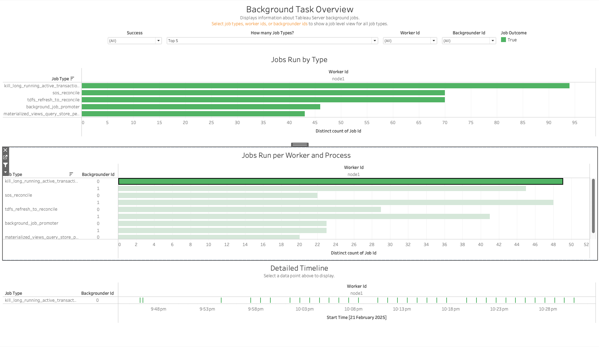
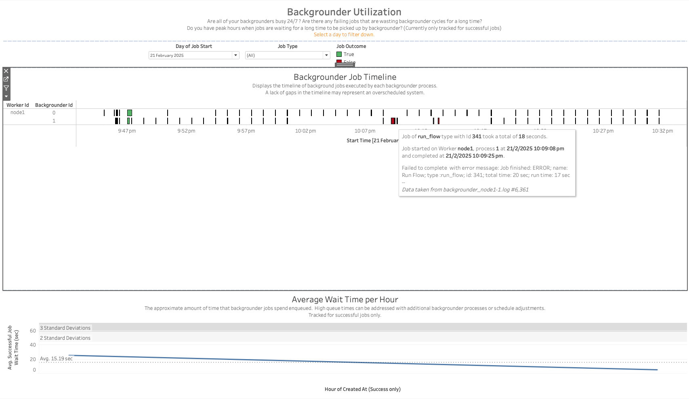
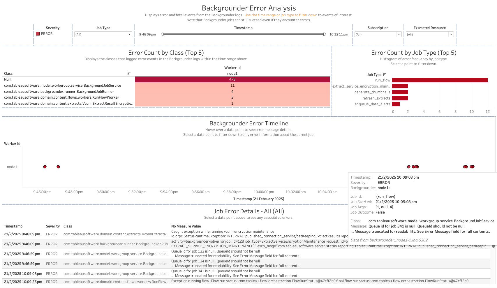
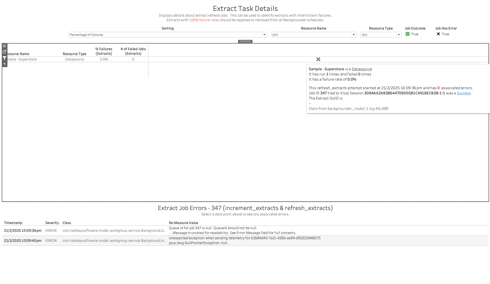
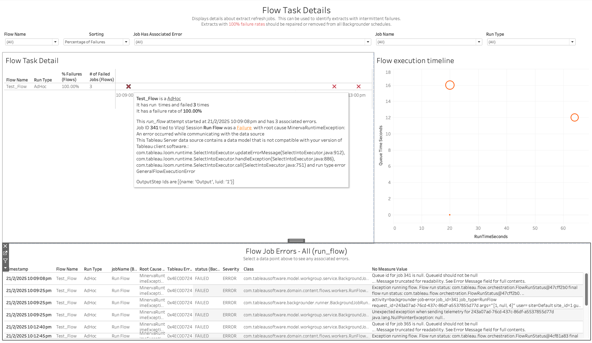
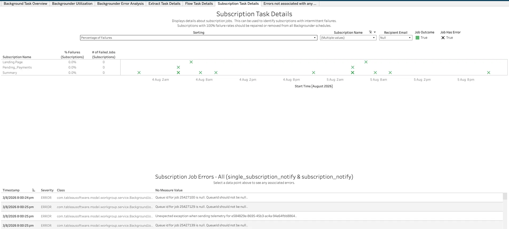
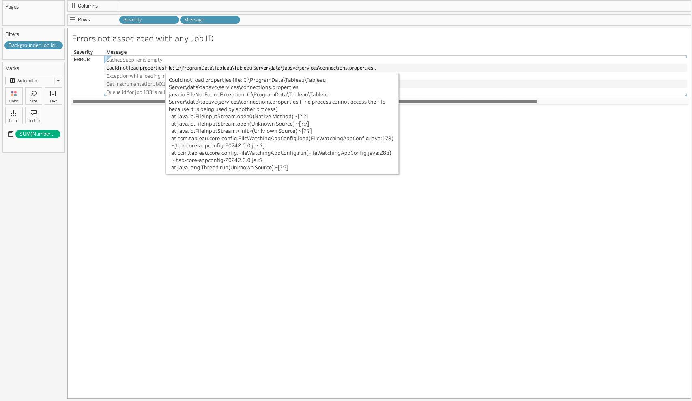

In this section:

* TOC
{:toc}

## What is it?
The Backgrounder workbook (`Backgrounder.twbx`) visualizes the Tableau Server backgrounder logs — the process responsible for running asynchronous background jobs such as extract refreshes, Prep flow runs, and subscription deliveries. It shows which jobs ran, how long they took, whether they succeeded or failed, and the errors logged along the way, broken out by job type (extract, flow, subscription) as well as by worker and backgrounder process.

The Backgrounder plugin only consumes the backgrounder Java logs, and writes out several related datasets: one row per job (start/end, worker, backgrounder process, run time, success/failure), plus job-type-specific detail (extract job detail, flow job detail, subscription job detail), and a separate dataset of error/fatal log lines (some of which can't be tied back to a specific job ID).

## Glossary of Important Terms to Understand Backgrounder Workbook Data and Dashboards

- **Job**: A single unit of asynchronous work processed by a backgrounder, identified by a Job ID. Common job types include `refresh_extracts`/`increment_extracts` (extract refreshes), `run_flow` (Prep flow runs), `single_subscription_notify`/`subscription_notify` (subscription deliveries), and various internal maintenance jobs (`sos_reconcile`, `background_job_promoter`, `kill_long_running_active_transactions`, etc.).
- **Worker Id / Backgrounder Id**: Worker Id identifies the physical/logical node running backgrounder processes; Backgrounder Id identifies the individual backgrounder process (there can be more than one per worker) that picked up and ran the job.
- **Job Outcome / Success**: Whether the job completed successfully (`True`) or failed (`False`). Note that a job can encounter and log errors while still ultimately succeeding — errors don't always mean job failure.
- **Queue / Wait Time**: The amount of time a job spent enqueued before a backgrounder process picked it up and started running it. High wait times can indicate the backgrounder pool is undersized or overscheduled for the number of jobs being submitted.

## When to use it?

- Get an overview of what kinds of background jobs are running on the server, how often, and which workers/backgrounder processes are handling them.
- Determine whether backgrounder processes are busy around the clock, or sit idle/overscheduled at certain hours.
- Identify extracts, flows, or subscriptions with a high or 100% failure rate that should be repaired, rescheduled, or removed.
- Investigate a specific failed job by drilling into its errors, root cause, and associated Vizql session.
- Review errors that don't tie back to any specific job ID (startup/config errors, etc.), which won't show up in any of the per-job-type dashboards.

## How to use it?

### Background Task Overview

Displays information about Tableau Server background jobs. Select job types, worker ids, or backgrounder ids to show a job-level view for all job types.

**Views:**
- ***Jobs Run by Type***: A bar chart of the number of distinct jobs run for each job type, broken down by Worker Id.
- ***Jobs Run per Worker and Process***: The same breakdown further split out by Backgrounder Id (the individual backgrounder process on that worker).
- ***Detailed Timeline***: Selecting a bar above populates a timeline of individual job start times for that job type/worker/backgrounder combination.

**Filters:**
- Success (Job Outcome) dropdown
- How many Job Types? (top N)
- Worker Id / Backgrounder Id dropdowns
- Job Outcome color legend

**Use Cases:**
- Get a quick sense of which job types dominate backgrounder activity on the server.
- Compare job counts across workers/backgrounder processes to spot an imbalanced workload.

### Backgrounder Utilization

Are all of your backgrounders busy 24/7? Are there any failing jobs that are wasting backgrounder cycles for a long time? Do you have peak hours when jobs are waiting a long time to be picked up by backgrounder? (Currently only tracked for successful jobs.)

**Views:**
- ***Backgrounder Job Timeline***: A timeline of every job executed by each backgrounder process (one row per Worker Id / Backgrounder Id), colored by Job Outcome. A lack of gaps in the timeline may represent an overscheduled system. Hovering over a mark shows the job type, ID, start/end time, and — for failed jobs — the error message.
- ***Average Wait Time per Hour***: The approximate amount of time successful jobs spent enqueued before running, averaged per hour, with 2/3-standard-deviation reference bands. High queue times can be addressed with additional backgrounder processes or schedule adjustments.

**Filters:**
- Day of Job Start dropdown
- Job Type dropdown
- Job Outcome color legend (True/False)

**Use Cases:**
- Identify backgrounder processes that are constantly busy (no gaps in the timeline) versus ones that are mostly idle.
- Spot hours of the day with elevated average wait times, which may call for adding backgrounder capacity or adjusting extract/subscription schedules to spread out load.

### Backgrounder Error Analysis

Displays error and fatal events from the Backgrounder logs. Use the time range or job type to filter down to events of interest. Note that Backgrounder jobs can still succeed even if they encounter errors.

**Views:**
- ***Error Count by Class (Top 5)***: The Java classes that logged the most error events in the selected time range.
- ***Error Count by Job Type (Top 5)***: A histogram of error frequency by job type; selecting a bar filters the rest of the dashboard.
- ***Backgrounder Error Timeline***: A scatter plot of individual error events over time, colored by Worker Id. Hovering shows the error detail; selecting a point filters the Job Error Details table below to only errors for that job's parent job.
- ***Job Error Details***: A table of every error/fatal log line matching the current filters — timestamp, severity, logging class, and message.

**Filters:**
- Severity color legend
- Job Type dropdown
- Timestamp range filter
- Subscription / Extracted Resource dropdowns

**Use Cases:**
- Find the most common error classes/messages across all backgrounder jobs, to prioritize what to investigate first.
- Trace a specific error event back to its parent job and see the full error detail (class, message, stack trace) for root-causing a failure.

### Extract Task Details

Displays details about extract refresh jobs. This can be used to identify extracts with intermittent failures. Extracts with 100% failure rates should be repaired or removed from all backgrounder schedules.

**Views:**
- ***Extract Task Detail table***: One row per extract (data source or workbook), showing its resource type, percentage of failed refresh jobs, and count of failed jobs. Sortable by percentage of failures. Hovering over a row's timeline shows the run history for that extract, including the associated Vizql session and whether each attempt succeeded.
- ***Extract Job Errors***: A table of error log lines associated with the selected extract's jobs.

**Filters:**
- Sorting dropdown (e.g. Percentage of Failures)
- Resource Name / Resource Type dropdowns
- Job Outcome / Job Has Error toggles

**Use Cases:**
- Identify data sources/workbooks whose extract refresh consistently or intermittently fails, so they can be repaired or removed from schedules.
- Drill into a specific failing extract's job history and error messages to find the root cause.

### Flow Task Details

Displays details about Tableau Prep flow runs processed by the backgrounder. This can be used to identify flows with intermittent failures. Flows with 100% failure rates should be repaired or removed from all backgrounder schedules.

**Views:**
- ***Flow Task Detail table***: One row per flow (and run type — AdHoc, Scheduled, etc.), showing percentage of failed runs and count of failed jobs, sortable by percentage of failures. Hovering shows the run history, including the associated Vizql session, run status, and (for failures) the root cause exception and affected output steps.
- ***Flow execution timeline***: A scatter plot of flow runs with run time (seconds) on one axis and queue time (seconds) on the other, useful for spotting flows that both run long and queue long.
- ***Flow Job Errors***: A table of error log lines for the selected flow's jobs, including flow name, run type, job ID, root cause, and Tableau error/status code fields.

**Filters:**
- Flow Name dropdown
- Sorting dropdown
- Job Has Associated Error dropdown
- Job Name / Run Type dropdowns

**Use Cases:**
- Identify flows that fail consistently or intermittently and should be fixed or removed from schedules.
- Distinguish flows that are slow to run from flows that are simply queued for a long time waiting on backgrounder capacity.
- Get the root-cause exception and Tableau error code for a specific failed flow run.

### Subscription Task Details

Displays details about subscription jobs. This can be used to identify subscriptions with intermittent failures. Subscriptions with 100% failure rates should be repaired or removed from all backgrounder schedules.

**Views:**
- ***Subscription Task Detail table***: One row per subscription, showing percentage of failed deliveries and count of failed jobs, sortable by percentage of failures. The timeline to the right plots each delivery attempt (success shown in green, failure as an X) over time.
- ***Subscription Job Errors***: A table of error log lines associated with the selected subscription's jobs.

**Filters:**
- Sorting dropdown
- Subscription Name / Recipient Email dropdowns
- Job Outcome / Job Has Error toggles

**Use Cases:**
- Identify subscriptions that are consistently failing to deliver, so they can be repaired or removed.
- See whether a subscription's failures are isolated one-offs or a persistent pattern over time.

### Errors Not Associated with any Job ID

Displays error and fatal log lines from the backgrounder logs that couldn't be tied back to a specific Job ID — for example, startup errors, configuration file problems, or telemetry/instrumentation failures that occur outside the context of any single job.

**Views:**
- A table of Severity and Message for every such error, with the full message/stack trace available in the tooltip.

**Filters:**
- Backgrounder Job Id filter (used to exclude/include job-associated errors, depending on how you've navigated in from another dashboard)

**Use Cases:**
- Catch backgrounder-level problems (bad config files, JMX/instrumentation issues, etc.) that wouldn't otherwise surface on the job-specific dashboards, since they aren't attached to any Job ID.

