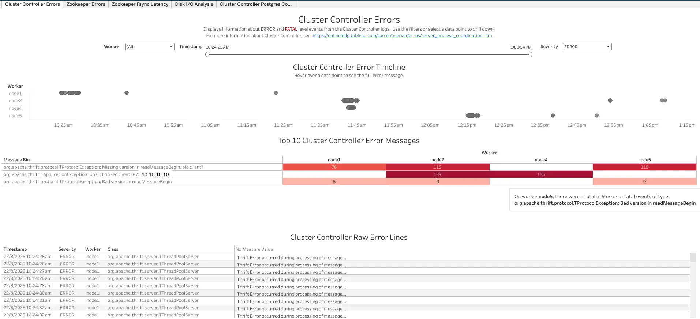
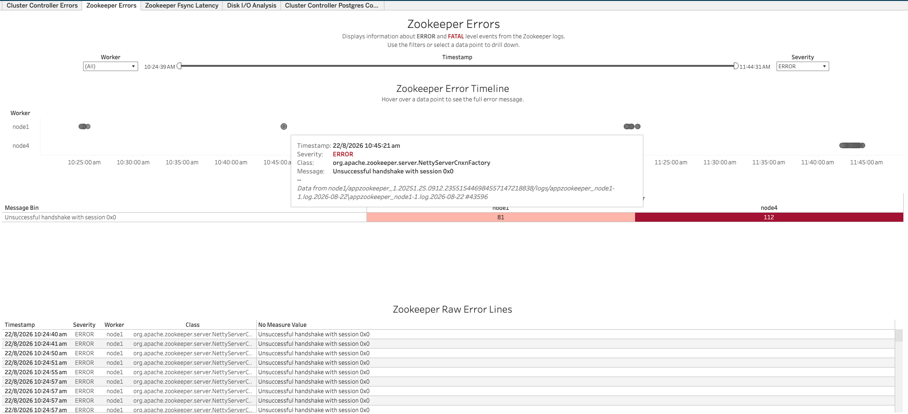
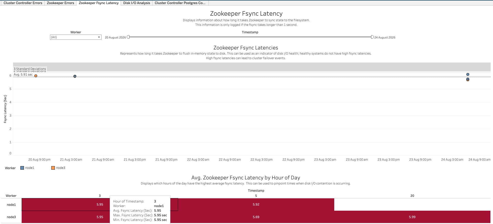
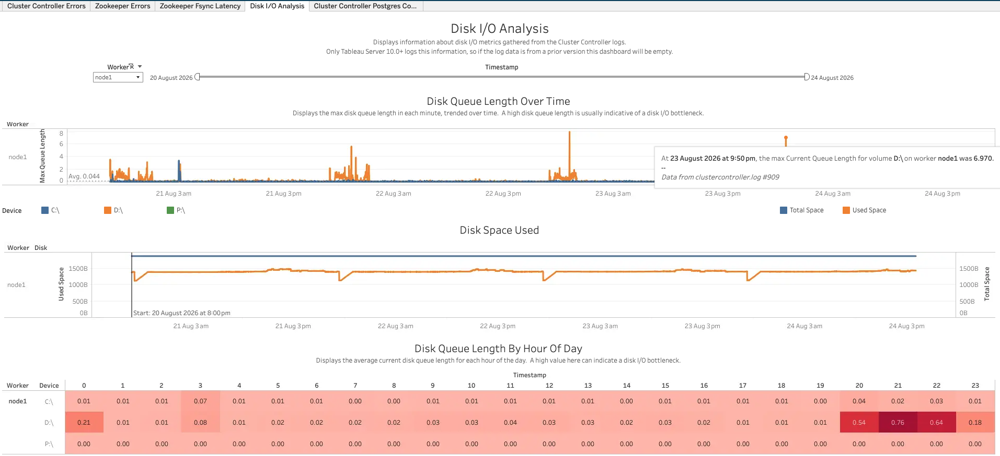
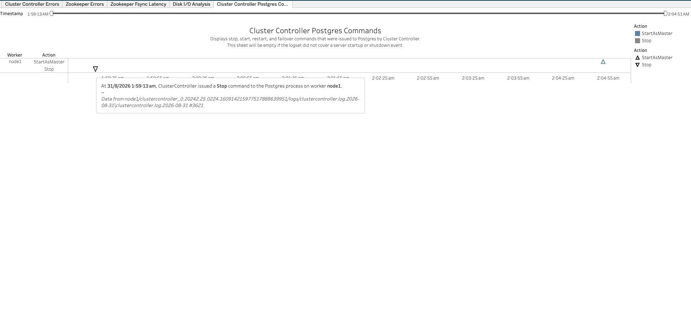

In this section:

* TOC
{:toc}

## What is it?
The ClusterController workbook (`ClusterController.twbx`) visualizes logs from Tableau Server's Cluster Controller process and the Zookeeper coordination service it depends on. It surfaces ERROR/FATAL events logged by both Cluster Controller and Zookeeper, Zookeeper's disk-sync (fsync) latency, Cluster Controller's disk I/O and disk space monitoring, and the start/stop/restart/failover commands Cluster Controller issued to the Postgres repository process.

## Glossary of Important Terms to Understand ClusterController Workbook Data and Dashboards

- **Fsync Latency**: How long it took Zookeeper to flush (fsync) its in-memory state to the filesystem. This is only logged when it takes longer than 1 second, and high values can lead to cluster failover events.
- **Disk Queue Length**: The max disk queue length recorded in a given minute for a device. A high value usually indicates a disk I/O bottleneck.
- **Postgres Command**: A start, stop, restart, or failover command that Cluster Controller issued to the Postgres repository process on a worker.
- **Message Bin**: A normalized/grouped version of an error message, used to roll up many similar raw log lines into a single row for counting.

## When to use it?

- Check whether Cluster Controller or Zookeeper logged any ERROR/FATAL events on a given worker or time range, and inspect the raw error messages.
- Check whether Zookeeper's fsync latency has spiked above 1 second, which can be an early indicator of disk I/O problems that lead to a cluster failover.
- Investigate disk I/O and disk space trends (queue length, used vs. total space per device) to diagnose a disk bottleneck.
- Confirm exactly when Cluster Controller started, stopped, restarted, or failed over the Postgres repository process, and on which worker.

## How to use it?

### Cluster Controller Errors

Displays information about ERROR and FATAL level events from the Cluster Controller logs. Use the filters or select a data point to drill down.

**Views:**
- ***Cluster Controller Error Timeline***: A scatter plot of ERROR/FATAL events by Worker over time. Hovering over a data point shows the full error message.
- ***Top 10 Cluster Controller Error Messages***: A breakdown of the most common error messages (grouped into Message Bins), by Worker, with the count of occurrences.
- ***Cluster Controller Raw Error Lines***: A table of raw error rows — Timestamp, Severity, Worker, Class, and Message — matching the current filters.

**Filters:**
- Worker dropdown
- Timestamp range filter
- Severity dropdown

**Use Cases:**
- Get a quick sense of which workers are logging the most Cluster Controller errors, and what the most common error messages are.
- Drill into the raw error lines for full detail on a specific error.

### Zookeeper Errors

Displays information about ERROR and FATAL level events from the Zookeeper logs. Use the filters or select a data point to drill down.

**Views:**
- ***Zookeeper Error Timeline***: A scatter plot of ERROR/FATAL events by Worker over time. Hovering over a data point shows the timestamp, severity, class, and full error message.
- ***Message Bin table***: A breakdown of the most common error messages, by Worker, with the count of occurrences.
- ***Zookeeper Raw Error Lines***: A table of raw error rows — Timestamp, Severity, Worker, Class, and Message — matching the current filters.

**Filters:**
- Worker dropdown
- Timestamp range filter
- Severity dropdown

**Use Cases:**
- Get a quick sense of which workers are logging the most Zookeeper errors, and what the most common error messages are.
- Drill into the raw error lines for full detail on a specific error.

### Zookeeper Fsync Latency

Displays information about how long it takes Zookeeper to sync state to the filesystem. This information is only logged if the fsync takes longer than 1 second.

**Views:**
- ***Zookeeper Fsync Latencies***: A scatter plot of fsync latency (seconds) over time, colored by Worker, with 2/3-standard-deviation reference bands. Represents how long it takes Zookeeper to flush in-memory state to disk — this can be used as an indicator of disk I/O health, since healthy systems do not have high fsync latencies, and high fsync latencies can lead to cluster failover events.
- ***Avg. Zookeeper Fsync Latency by Hour of Day***: A table of average fsync latency by Worker for each hour of the day (with max/min available on hover), to help pinpoint times when disk I/O contention is occurring.

**Filters:**
- Worker dropdown
- Timestamp range filter

**Use Cases:**
- Determine whether Zookeeper's fsync latency is elevated — since it's only logged at all once it exceeds 1 second — as an early warning sign of disk I/O problems that could trigger a cluster failover.
- Pinpoint which hour(s) of the day disk I/O contention tends to occur.

### Disk I/O Analysis

Displays information about disk I/O metrics gathered from the Cluster Controller logs.

**Views:**
- ***Disk Queue Length Over Time***: The max disk queue length in each minute, trended over time by Worker and Device. A high disk queue length is usually indicative of a disk I/O bottleneck. Hovering over a point shows the exact queue length value and the source log line it came from.
- ***Disk Space Used***: Used space vs. total space per disk/device per Worker, trended over time.
- ***Disk Queue Length By Hour Of Day***: The average current disk queue length for each hour of the day, by Worker and Device. A high value here can indicate a disk I/O bottleneck.

**Filters:**
- Worker dropdown
- Timestamp range filter

**Use Cases:**
- Confirm whether disk queue length or used space trended abnormally on a given device/worker, which can point to a disk I/O bottleneck.
- Cross-reference against the Zookeeper Fsync Latency dashboard, since both point at the same underlying disk I/O health.

### Cluster Controller Postgres Commands

Displays stop, start, restart, and failover commands that were issued to Postgres by Cluster Controller. This sheet will be empty if the logset did not cover a server startup or shutdown event.

**Views:**
- ***Postgres Command Timeline***: A plot of every start/stop/restart/failover command issued to the Postgres process, by Worker, over time. Hovering over a mark shows the worker, the exact command issued, the timestamp, and the source log line it came from.

**Filters:**
- Timestamp range filter

**Use Cases:**
- Confirm exactly when, and on which worker, Cluster Controller started, stopped, restarted, or failed over the Postgres repository process — useful when investigating a server startup/shutdown or an unexpected Postgres failover.
- Keep in mind this dashboard will be empty unless the logset spans a server startup or shutdown event.

