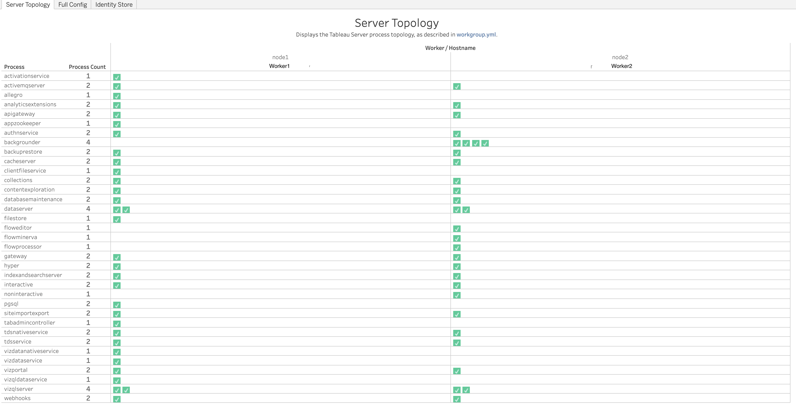
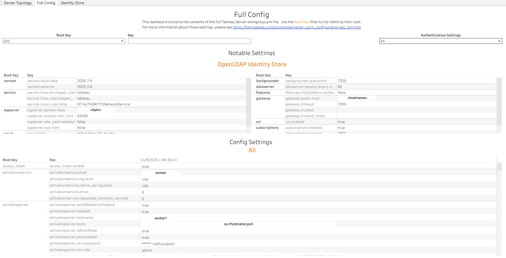

In this section:

* TOC
{:toc}

## What is it?
The Config workbook (`Config.twbx`) visualizes the Tableau Server configuration captured in the `workgroup.yml` and `tabsvc.yml` files — which process types are deployed on which worker(s), and the full set of configuration key/value settings on the server.

## Glossary of Important Terms to Understand Config Workbook Data and Dashboards

- **Root Key**: The top-level segment of a configuration key (for example, the Root Key of `wgserver.domain.fqdn` is `wgserver`). Used to group and filter related settings together.
- **Process Count**: The total number of instances of a given process type running across the whole deployment. Some process types (e.g. `dataserver`, `vizqlserver`, `backgrounder`) can run multiple instances on the same worker.

## When to use it?

- Confirm which worker(s) a given Tableau Server process type is running on, and how many instances of it are deployed.
- Look up the exact value of a specific Tableau Server configuration setting without needing direct access to the server.
- Check authentication, SSL, or other server-wide settings you weren't sure had been changed.

## How to use it?

### Server Topology

Displays the Tableau Server process topology, as described in `workgroup.yml`.

**Views:**
- ***Process Topology table***: One row per process type, showing its total Process Count across the deployment, and a grid of checkmarks by Worker/Hostname. Each checkmark represents one running instance of that process on that worker; a process type with multiple checkmarks under the same worker (e.g. `dataserver`, `vizqlserver`) has multiple instances running there.

**Use Cases:**
- Quickly confirm which workers run a given process type and how many instances, without manually parsing `workgroup.yml`.
- Compare process counts and placement across workers to spot an imbalanced or unexpected topology.

### Full Config

Contains the contents of the full Tableau Server `workgroup.yml` file.

**Views:**
- ***Notable Settings***: A curated set of frequently-relevant settings shown side by side — including the detected identity store configuration (e.g. `wgserver.domain.fqdn`, `service.runas.username`) and other commonly-checked settings such as `backgrounder.querylimit`, `dataserver.session.expiry.time`, `gateway.public.host`, `ssl.enabled`, and `subscriptions.enabled`.
- ***Config Settings***: A full Root Key / Key / Value table of every setting found in the config files.

**Filters:**
- Root Key dropdown
- Key search box
- Authentication Settings dropdown

**Use Cases:**
- Look up the exact value of any Tableau Server configuration setting captured in `workgroup.yml`/`tabsvc.yml`.
- Confirm authentication, identity store, or SSL-related settings without accessing the server directly.
- Use the Root Key or Key filters to jump straight to a specific group of settings instead of scrolling through the entire config.

