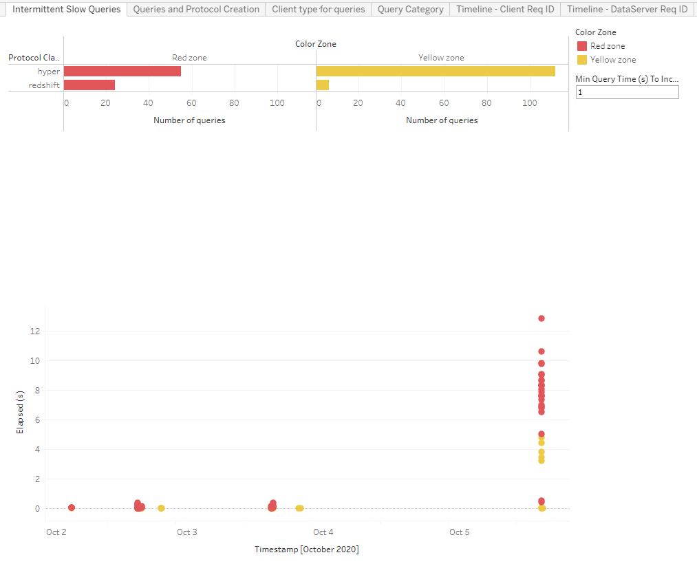
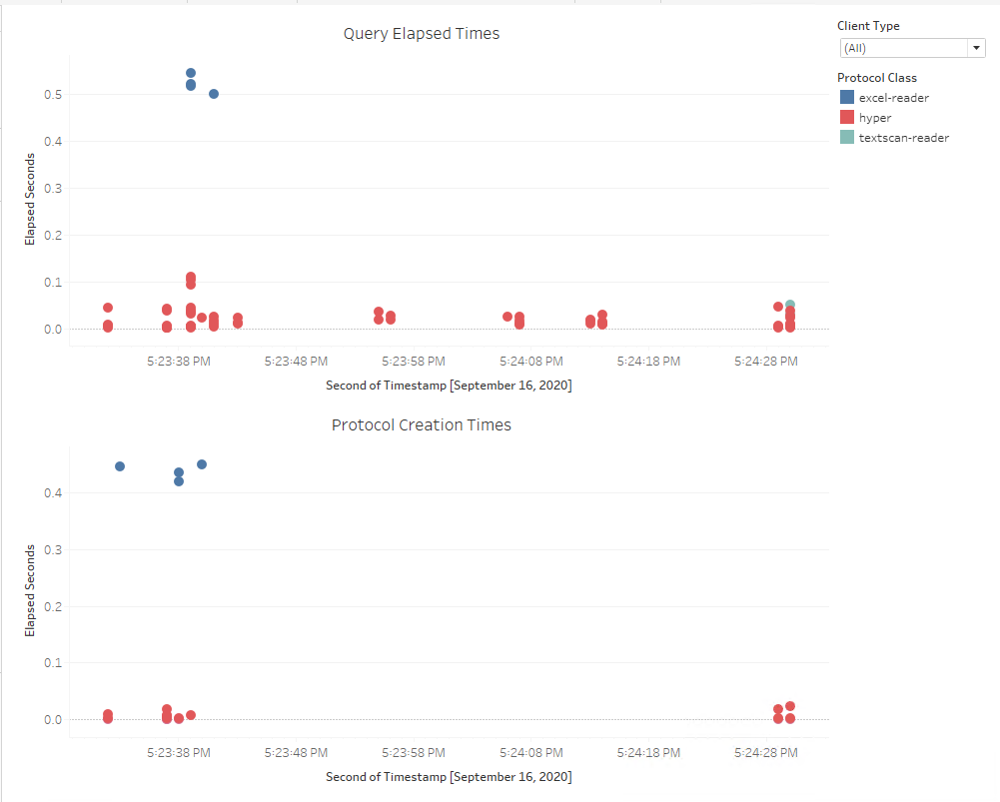
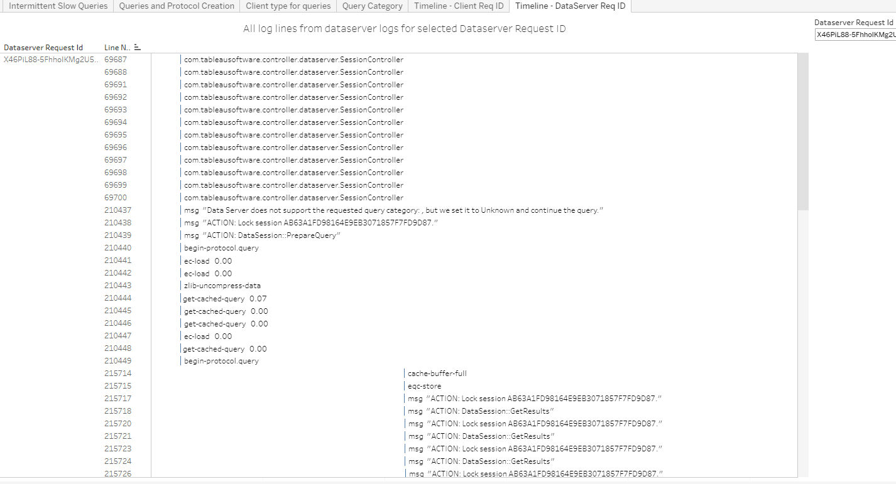

In this section:

* TOC
{:toc}

## What is it?
The DataServer workbook can be used to visualize information contained in the DataServer process Java and C++ logs. DataServer processes come into play when using published datasources. If your Tableau Server installation has published datasources this workbook can be used to provide operational insight into the DataServer processes.
 

## Glossary
Glossary of Important Terms to Understand DataServer Workbook Data and Dashboards

-  **Client Request ID**:	DataServer has multiple clients, for example, VizQL and Backgrounder. Client Request ID refers to the ID of the request sent to the client (VizQL or Backgrounder). This is different from the DataServer Request ID. When servicing a single request, a VizQL client can initiate multiple DataServer requests each with its own Request ID.
- **Protocol Creation**:	A protocol can be thought of as a database connection. At a high level, creating a protocol involves establishing a connection to a database.
- **Sqlproxy**:	Each protocol has a database class associated with it that identifies the type of database. For example, a protocol to the Hyper database, has its database class set to hyper. The sqlproxy database class is a special term used for connections to published datasources. From a DataServer client perspective, a published datasource is just like any other database and the database class that is logged for published datasource connections/queries is ‘sqlproxy’.

## When to use it?

The ART workbook (link to ART workbook guide page) can help narrow down on performance bottlenecks through flamecharts. However, when published datasources are used, the ART flamecharts will only highlight slow ‘sqlproxy’ queries or slow ‘sqlproxy’ connections. It will be unable to provide further details regarding the slowness. Using the DataServer workbook, the user can see details of all the dataserver requests that were issued for that client request. This can help further narrow down the area of slowness within dataserver.

## How to use it?

### Intermittent Slow Queries

This dashboard is very similar to the Intermittent Slow queries dashboard from the ART workbook (link to ART workbook guide page). 

**Use Cases:**
- For published datasources, the dashboard will highlight intermittent database performance for the underlying database.
   
   

### Queries and Protocol Creation

This dashboard shows elapsed times for all queries and connection requests from DataServer. Each mark in the top Query Elapsed Times view (see below) corresponds to a single query issued by DataServer against the underlying database. Each mark in the bottom Protocol Creation Times view corresponds to a single protocol creation (i.e. connection to a database) request from DataServer.

**Use Cases:**
- You can use this dashboard to easily identify slow protocol creation and slow queries for a specific database type.
   
   
   
### Client type for queries

This view provides information on how much of the DataServer load is driven by requests from vizqlserver (view loads) v/s backgrounder (extract refreshes, subscriptions, data driven alerts).
   
   
   
### Query Category

This view breaks down DataServer queries by category.
   
   
   
### Timeline – Client Req ID

Using the ART workbook, the user can copy the client (vizqlserver) request ID and enter it in the top right ‘Client Request Id’ box. The top view in this dashboard then lists out all the dataserver requests issued as part of that client request. Each row in the top view corresponds to a single dataserver request. Clicking on any row then shows a timeline of all log messages corresponding to that dataserver request, from both the Java and C++ logs.

   
   
### Timeline – DataServer Req ID

This view is like the ‘Timeline – Client Req ID’ view; but is based on the user provided dataserver request ID. If the user wants to dig into a specific dataserver request ID and get the timeline, then this view can be used.  

   
   
   
