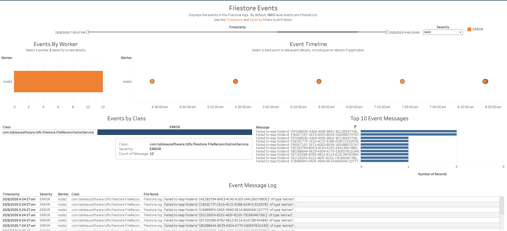

In this section:

* TOC
{:toc}

## What is it?
The Filestore process manages the storage of data extracts on Tableau Server, and — in highly available, multi-node deployments — keeps extracts synchronized across File Store nodes so they stay available if one node goes down. For more information on this process, see [Filestore Process](https://help.tableau.com/current/server/en-us/server_process_filestore.htm){:target="_blank"}.

The Filestore workbook (`Filestore.twbx`) visualizes the events logged by this process. By default, INFO-level events are filtered out, so the workbook focuses on ERROR (and higher) severity events.

## Glossary of Important Terms to Understand Filestore Workbook Data and Dashboards

- **Class**: The Java class that logged the event (for example, `com.tableausoftware.tdfs.filestore.FileReconciliationService`).
- **Message Bin**: A normalized/grouped version of an event message, used to roll up many similar raw log lines into a single row for counting (e.g. grouping every "Failed to reap folderId '...'" message together regardless of the specific folder ID).

## When to use it?

- Check whether the Filestore process is logging errors on a given worker, and how frequently.
- Identify the most common Filestore error messages across the logset.
- Investigate specific extract storage or synchronization problems (e.g. failures cleaning up/reconciling extract folders) that could affect extract availability, especially in a multi-node File Store deployment.

## How to use it?

### Filestore Events

Displays the events in the Filestore logs. By default, INFO-level events are filtered out. Use the Timestamp and Severity filters to drill down.

**Views:**
- ***Events By Worker***: A bar chart of event counts for the selected severity, broken down by Worker.
- ***Event Timeline***: A scatter plot of events by Worker over time. Selecting a data point shows event details, including error details if applicable.
- ***Events by Class***: A table of event counts by Class, for the selected severity. Hovering over a cell shows the class, severity, and count of matching messages.
- ***Top 10 Event Messages***: A bar chart of the most frequent event messages (grouped into Message Bins) by number of records.
- ***Event Message Log***: A table of raw event rows — Timestamp, Severity, Worker, Class, File Name, and Message — matching the current filters.

**Filters:**
- Timestamp range filter
- Severity dropdown (INFO is excluded by default)

**Use Cases:**
- Get a quick sense of which workers are logging the most Filestore errors, and what the most common error messages are.
- Drill into the raw event log for full detail on a specific error, including the source log file.

