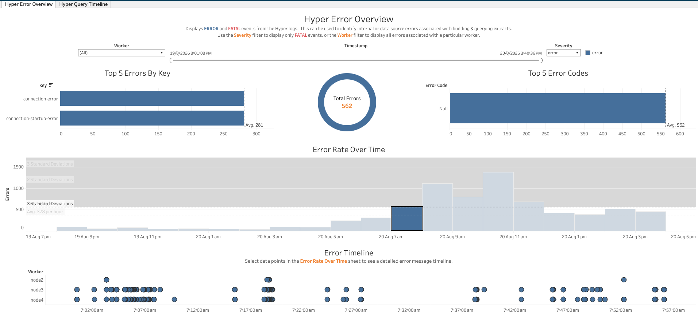
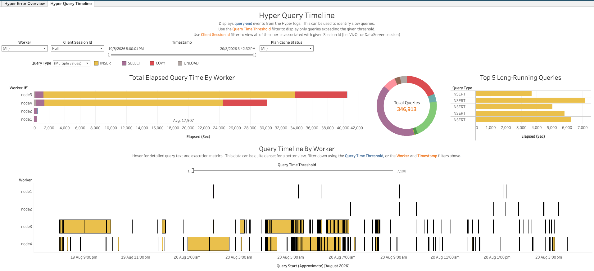
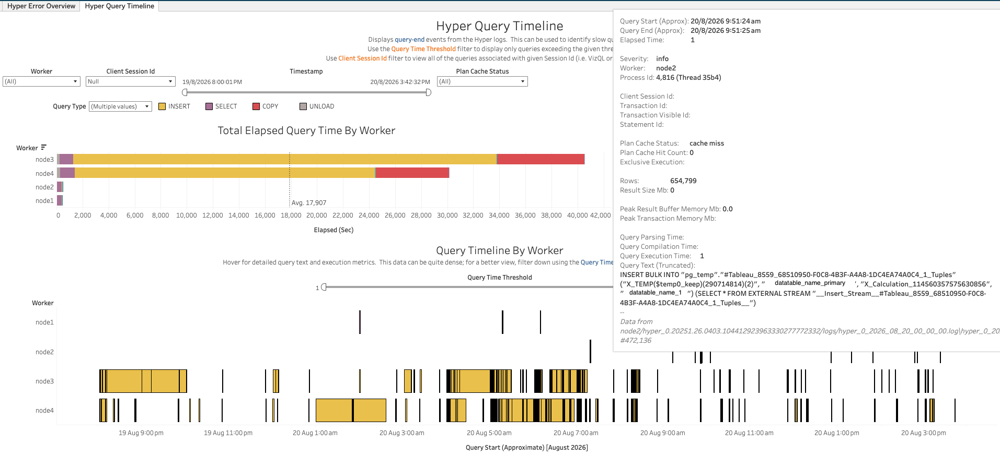

In this section:

* TOC
{:toc}

## What is it?
The Hyper workbook (`Hyper.twbx`) visualizes events from Tableau Server's Hyper process — the engine that builds and queries data extracts. It surfaces ERROR/FATAL events logged by Hyper, as well as detailed timing and execution metrics for individual queries, including how long each query took and where that time was spent.

## Glossary of Important Terms to Understand Hyper Workbook Data and Dashboards

- **Key**: An internal identifier for the type of error event (for example, `connection-error`, `connection-startup-error`).
- **Query Type**: The category of SQL statement a query represents — INSERT, SELECT, COPY, or UNLOAD.
- **Plan Cache Status**: Whether Hyper found a cached query plan to reuse for the current query, or had to compile a new one (e.g. "cache miss").
- **Client Session Id**: Identifies the client session (such as a VizQL or DataServer session) that issued the query.
- **Query Time Threshold**: The minimum elapsed query duration (in seconds) to filter down to when looking for slow queries.

## When to use it?

- Determine whether Hyper errors are concentrated on a particular worker, or spiking at a specific time.
- Identify the most common error keys Hyper is logging.
- Find slow-running queries on a given worker using the Query Time Threshold filter.
- Trace a specific slow query back to its exact text, timing breakdown, and source log line.
- Look up all queries associated with a specific Client Session Id, to correlate against a VizQL or DataServer session investigated elsewhere.

## How to use it?

### Hyper Error Overview

Displays ERROR and FATAL events from the Hyper logs. This can be used to identify internal or data source errors associated with building & querying extracts. Use the Severity filter to display only FATAL events, or the Worker filter to display all errors associated with a particular worker.

**Views:**
- ***Top 5 Errors By Key***: A bar chart of the most common error keys.
- ***Total Errors***: The total count of ERROR/FATAL events matching the current filters.
- ***Top 5 Error Codes***: A bar chart of the most common error codes associated with these events.
- ***Error Rate Over Time***: A histogram of error counts per hour, with standard-deviation reference bands to flag abnormal spikes.
- ***Error Timeline***: Selecting a bar in Error Rate Over Time populates a per-worker timeline of the individual error events in that period.

**Filters:**
- Worker dropdown
- Severity dropdown
- Timestamp range filter

**Use Cases:**
- Spot an hour with an abnormal spike in Hyper errors, then drill into the Error Timeline to see exactly which worker(s) and events were involved.
- Identify which error key dominates the error volume, to help prioritize investigation.

### Hyper Query Timeline

Displays query-end events from the Hyper logs. This can be used to identify slow queries. Use the Query Time Threshold filter to display only queries exceeding the given threshold. Use the Client Session Id filter to view all of the queries associated with a given session id (i.e. VizQL or DataServer session).

**Views:**
- ***Total Elapsed Query Time By Worker***: A bar chart of total elapsed query time per worker, colored by Query Type.
- ***Total Queries***: A donut chart of total query count, colored by Query Type.
- ***Top 5 Long-Running Queries***: A bar chart of the individual queries with the highest elapsed time.
- ***Query Timeline By Worker***: A per-worker timeline of individual queries, colored by Query Type. Hovering over a mark shows detailed query text and execution metrics — Query Start/End time, Elapsed Time, Severity, Worker, Process Id, Client Session Id, Transaction/Statement Id, Plan Cache Status and Hit Count, Rows, Result Size, Peak Result Buffer Memory, Query Parsing/Compilation/Execution Time, the (truncated) query text, and the source log file/line.

**Filters:**
- Worker dropdown
- Client Session Id dropdown
- Timestamp range filter
- Plan Cache Status dropdown
- Query Type legend
- Query Time Threshold slider

**Use Cases:**
- Use the Query Time Threshold filter/slider to surface only slow-running queries, then drill into the exact query text and timing breakdown for one.
- Compare total elapsed query time across workers to spot one that's doing disproportionately more (or slower) query work.
- Filter to a specific Client Session Id to see every query issued by that session.

