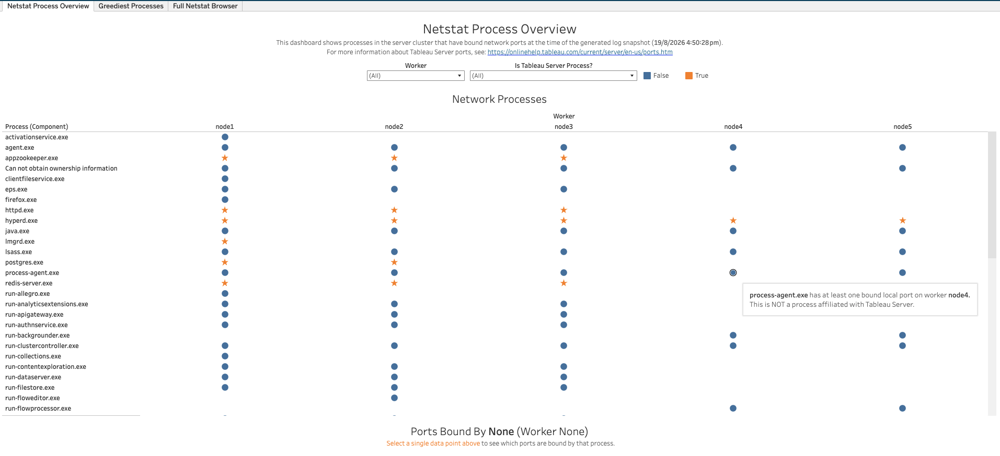
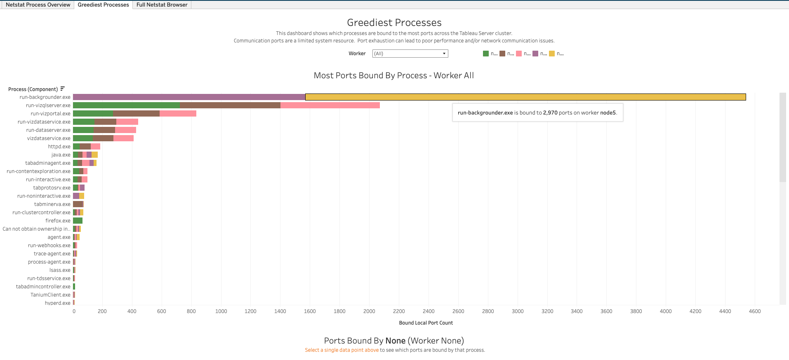
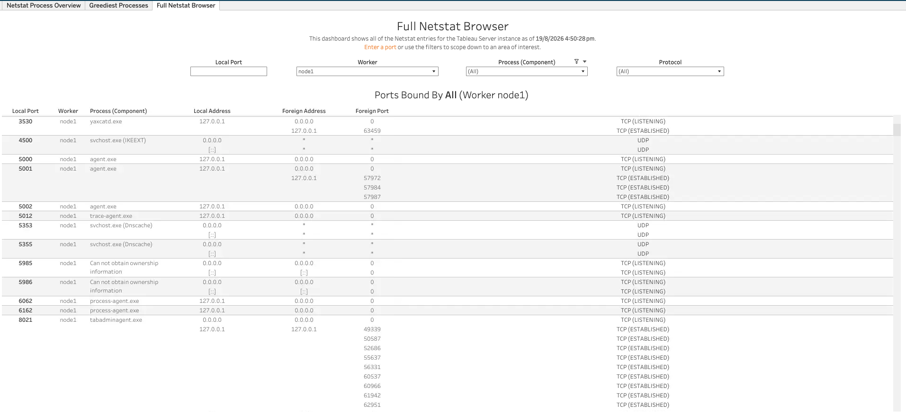

In this section:

* TOC
{:toc}

## What is it?
The Netstat workbook (`Netstat.twbx`) visualizes the `netstat` output collected from Tableau Server, showing which processes had bound network ports and active connections at the time the logs were captured. Unlike most other LogShark workbooks, this is a single point-in-time snapshot rather than a trend over a time range. For more information about Tableau Server ports, see [Ports](https://onlinehelp.tableau.com/current/server/en-us/ports.htm){:target="_blank"}.

## Glossary of Important Terms to Understand Netstat Workbook Data and Dashboards

- **Is Tableau Server Process?**: Whether a process was recognized as a known Tableau Server executable, as opposed to an OS service or third-party process that also happens to have bound ports.
- **Bound Local Port Count**: The number of local ports a process is bound to. Ports are a limited system resource, so a process bound to an unusually large number of ports can be worth investigating.
- **TCP State (e.g. LISTENING, ESTABLISHED)**: The state of a given TCP connection — LISTENING means the process is waiting for incoming connections on that port, while ESTABLISHED means an active connection is open.

## When to use it?

- Get a snapshot of which processes on which workers had bound network ports at the time the logs were captured.
- Identify processes that are bound to an unusually large number of ports, which can lead to port exhaustion and network communication issues.
- Look up exactly what a specific local port was bound to, or what foreign address/port a connection was established with, on a given worker.
- Distinguish Tableau Server's own processes from other OS/third-party processes when reviewing bound ports.

## How to use it?

### Netstat Process Overview

This dashboard shows processes in the server cluster that have bound network ports at the time of the generated log snapshot.

**Views:**
- ***Network Processes***: A grid of every process (by Worker) that has at least one bound local port. Selecting a data point populates the "Ports Bound By" table below with that process/worker's bound ports.

**Filters:**
- Worker dropdown
- Is Tableau Server Process? dropdown (True/False)

**Use Cases:**
- Confirm whether an unfamiliar process has bound ports on a given worker, and whether it's a recognized Tableau Server process or not.
- Select a process/worker combination to drill into exactly which ports it has bound.

### Greediest Processes

This dashboard shows which processes are bound to the most ports across the Tableau Server cluster. Communication ports are a limited system resource — port exhaustion can lead to poor performance and/or network communication issues.

**Views:**
- ***Most Ports Bound By Process***: A bar chart of Bound Local Port Count by process, colored/stacked by Worker. Hovering over a segment shows the exact port count for that process/worker.

**Filters:**
- Worker dropdown

**Use Cases:**
- Identify which process is consuming the most ports across the cluster, and on which worker(s).
- Spot a process with an unexpectedly high port count that could be at risk of port exhaustion.

### Full Netstat Browser

This dashboard shows all of the Netstat entries for the Tableau Server instance. Enter a port or use the filters to scope down to an area of interest.

**Views:**
- ***Ports Bound By table***: A row per bound port/connection, showing Local Port, Worker, Process (Component), Local Address, Foreign Address, Foreign Port, and Protocol/TCP State.

**Filters:**
- Local Port search box
- Worker dropdown
- Process (Component) dropdown
- Protocol dropdown

**Use Cases:**
- Look up exactly which process owns a specific local port on a specific worker.
- Investigate active (ESTABLISHED) connections to/from a given process to see what it's communicating with.

