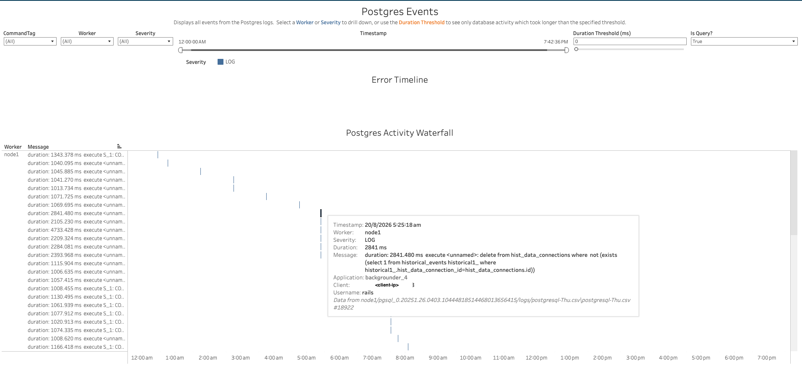

In this section:

* TOC
{:toc}

## What is it?
The Postgres workbook (`Postgres.twbx`) visualizes events logged by Tableau Server's Postgres repository — the internal database that stores Tableau Server's metadata (users, sites, permissions, job history, etc.). It shows every logged event, including query duration where available, along with the client, application, and username that issued it.

## Glossary of Important Terms to Understand Postgres Workbook Data and Dashboards

- **CommandTag**: The type of database command associated with an event (used to filter events by command type).
- **Duration**: How long a piece of database activity took to execute, in milliseconds — parsed from Postgres's own logged "duration: ... ms" messages.
- **Is Query?**: Whether an event represents a database query.
- **Application / Client / Username**: The connecting application/component name (e.g. `backgrounder_4`), the client IP address, and the database username associated with the event.

## When to use it?

- Investigate slow-running activity against the Postgres repository using the Duration Threshold filter.
- Determine which Tableau Server component or application is generating a given piece of database activity.
- Review logged Postgres events by severity or worker.
- Trace a specific slow query back to its exact log file and line for deeper investigation.

## How to use it?

### Postgres Events

Displays all events from the Postgres logs. Select a Worker or Severity to drill down, or use the Duration Threshold to see only database activity which took longer than the specified threshold.

**Views:**
- ***Error Timeline***: A timeline of events matching the current filters, colored by Severity.
- ***Postgres Activity Waterfall***: A per-worker breakdown of individual database activity events, plotted over time. Hovering over a mark shows the full event detail — Timestamp, Worker, Severity, Duration, Message, Application, Client, Username, and the source log file/line.

**Filters:**
- CommandTag dropdown
- Worker dropdown
- Severity dropdown
- Timestamp range filter
- Duration Threshold (ms)
- Is Query? dropdown

**Use Cases:**
- Set the Duration Threshold to surface only slow-running database activity.
- Identify which application/component is generating a given piece of slow database activity.
- Drill into the exact query text and duration for a specific event, and trace it back to the source log line.

