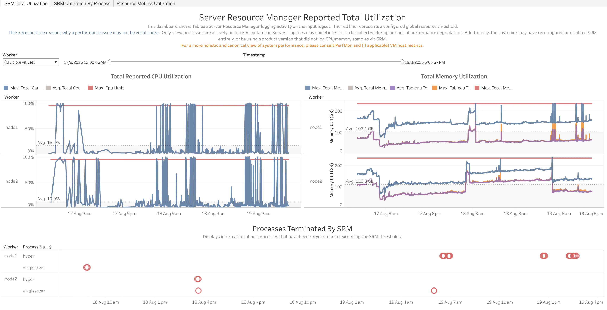
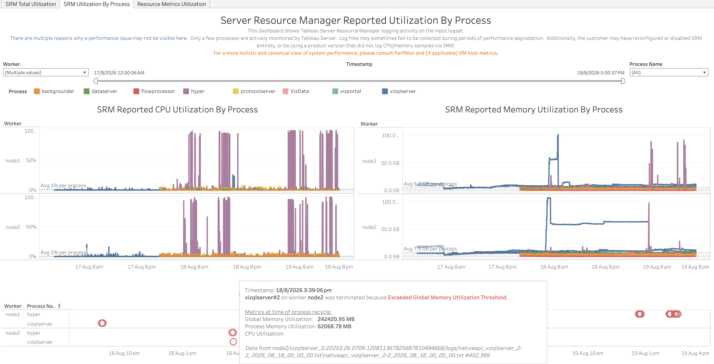
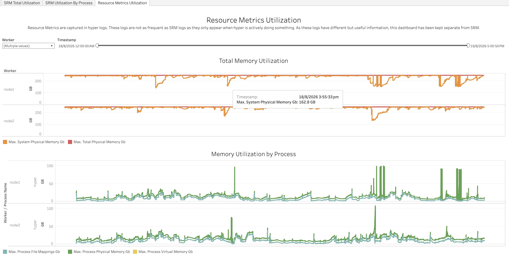

In this section:

* TOC
{:toc}

## What is it?
The ResourceManager workbook (`ResourceManager.twbx`) visualizes Tableau Server's Server Resource Manager (SRM) activity, plus a separate set of resource metrics reported by Hyper. SRM is the component that watches a process's CPU and memory usage against configured thresholds and terminates ("recycles") a process that exceeds them. This workbook shows how close CPU/memory usage got to those thresholds over time, and exactly which processes were terminated by SRM and when.

**Important — what SRM does and doesn't cover:**
- SRM only monitors Tableau Server's native (C++) processes: backgrounder, dataserver, flowprocessor, protocolserver, vizportal, vizqlserver, and VizData, plus Hyper. Some Tableau Server services are actually implemented as a pair of cooperating processes — a Java process and a native process. For example, Backgrounder has both a Java process and a native process that communicate with each other, and most of the heavy lifting is done by the native process. SRM has visibility into, and can only terminate, the native process side — it has no visibility into the Java process side of these services.
- This means a performance issue that lives on the Java side of a service (or in a process type SRM doesn't monitor at all) will not show up anywhere in this workbook, even though it may still be the root cause of a customer's problem. For a full breakdown of Tableau Server's processes, see [Tableau Server Processes](https://help.tableau.com/current/server/en-us/processes.htm){:target="_blank"}.
- The **Resource Metrics Utilization** dashboard is a separate source of data from SRM: it comes only from Hyper's own logs. Because Hyper logs total system memory usage (across every process on the machine, not just the ones SRM monitors) whenever it's active, this dashboard can surface system-wide memory pressure even when it isn't attributable to an SRM-monitored process — but it's only reported when Hyper happens to be doing something, so it is not a continuous or complete substitute for the SRM dashboards.
- As called out directly on the SRM dashboards themselves: a performance issue may not show up here for several reasons — only a few processes are actively monitored by SRM, log files can fail to be collected during periods of performance degradation, or SRM may have been reconfigured/disabled, or the Tableau Server version in use may not log CPU/memory samples via SRM at all. For a more holistic and canonical view of system performance, consult PerfMon and (if applicable) VM host metrics alongside this workbook, rather than relying on it alone.

## Glossary of Important Terms to Understand ResourceManager Workbook Data and Dashboards

- **Global threshold/limit**: A resource limit applied to the sum of all SRM-monitored processes on a worker combined (all-processes CPU or memory limit).
- **Process recycle/termination**: When a process exceeds a configured threshold for long enough, SRM terminates it so it can be restarted cleanly, rather than let it continue consuming excess resources.
- **Process instance (e.g. `vizqlserver#2`)**: Several process types run multiple instances per worker; the number distinguishes which specific instance was involved in a sample or termination event.

## When to use it?

- Get a sense of how close a worker's monitored native processes are running to their configured CPU/memory thresholds over time.
- Find out exactly when and why SRM terminated a process, including the specific process instance and the metrics recorded at the moment of termination.
- Break resource usage down by individual process type to see which one is driving overall CPU/memory pressure on a worker.
- Cross-check overall system memory pressure (via the Hyper-sourced Resource Metrics Utilization dashboard) against what SRM itself reported, keeping in mind SRM's blind spots described above.

## How to use it?

### SRM Total Utilization

Shows Tableau Server Resource Manager logging activity on the input logset. The red line represents a configured global resource threshold.

**Views:**
- ***Total Reported CPU Utilization***: Per worker, the maximum and average total CPU utilization reported by SRM across all monitored processes, against the configured CPU limit (red line).
- ***Total Memory Utilization***: Per worker, total memory utilization (max/avg) alongside the "Tableau total" memory utilization (max/avg — the portion attributable to Tableau's own monitored processes), against the configured total memory limit (red line).
- ***Processes Terminated By SRM***: A timeline, by worker and process name, of every process termination event.

**Filters:**
- Worker dropdown
- Timestamp range filter

**Use Cases:**
- See how often and how close total CPU/memory usage came to the configured global threshold on each worker.
- Get a quick overview of which workers/processes had termination events, and roughly when, before drilling into per-process detail.

### SRM Utilization By Process

Shows the same Tableau Server Resource Manager logging activity, broken down by individual process type instead of totaled across all processes.

**Views:**
- ***SRM Reported CPU Utilization By Process***: Per worker, CPU utilization over time colored by process (backgrounder, dataserver, flowprocessor, hyper, protocolserver, VizData, vizportal, vizqlserver).
- ***SRM Reported Memory Utilization By Process***: The same breakdown for memory utilization.
- ***Processes Terminated By SRM***: The same termination timeline as on the SRM Total Utilization dashboard. Hovering over a termination event shows the specific process instance, the reason (e.g. "Exceeded Global Memory Utilization Threshold"), the global/process memory and CPU utilization recorded at the moment of recycle, and the source log file/line the event was read from.

**Filters:**
- Worker dropdown
- Timestamp range filter
- Process Name dropdown

**Use Cases:**
- Identify which specific process type (and instance) is responsible for driving CPU or memory pressure on a worker.
- Get the exact metrics SRM recorded at the moment it terminated a process, and trace that back to the originating log line for deeper investigation.

### Resource Metrics Utilization

Resource Metrics are captured in Hyper logs. These logs are not as frequent as SRM logs, as they only appear when Hyper is actively doing something. Because this data source and cadence differs from SRM, this dashboard is kept separate from the SRM dashboards above.

**Views:**
- ***Total Memory Utilization***: Per worker, the maximum system physical memory in use (across all processes on the machine — not just SRM-monitored ones) versus the machine's total physical memory capacity.
- ***Memory Utilization by Process***: Hyper's own process-level memory footprint (max process physical memory, virtual memory, and file mappings, in GB) over time.

**Filters:**
- Worker dropdown
- Timestamp range filter

**Use Cases:**
- Get a system-wide view of memory pressure on a worker that isn't limited to only the processes SRM actively monitors, useful for spotting memory pressure caused by a process SRM doesn't track.
- Correlate a spike in total system memory usage against Hyper's own memory footprint, to help determine whether Hyper itself is a significant contributor or whether the pressure is coming from elsewhere on the machine.

