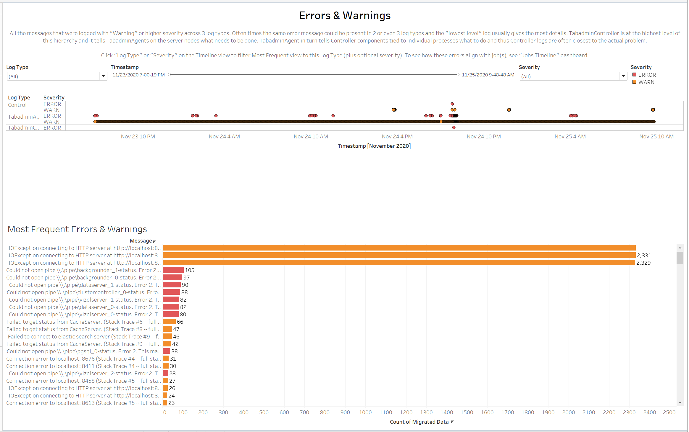
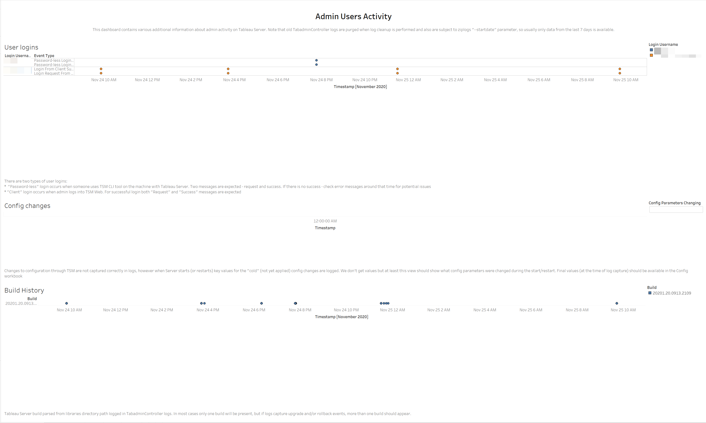
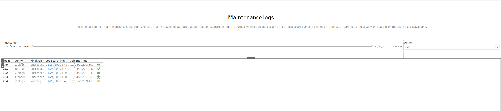

In this section:

* TOC
{:toc}

## What is it?
The TabadminController Logshark plugin parses the tabadmincontroller, tabadminagent and process control logs for Tableau Server and provides a set of dashboards for a visual analysis of errors and timelines associated with jobs in a Tableau Server environment.

**Important Notes:**
- The tabadmincontroller, tabadminagent, and process control logs are rotated as are other logs and are subject to cleanups.  In most cases we only capture the last 7 days of logs by default unless the admin uses the date parameter (-d) and sets a longer period for capturing logs.  This means we do not have the opportunity to see a life-long history of data from these logs as we could with tabadmin workbook.  As tsm logs are not included currently in the ziplogs capture, these cannot be used as part of the Logshark analysis.
- The work done by tabadmincontroller can potentially be multi-threaded and this means there is not a way to attribute an arbitrary log line to a specific task.  This means it is not possible to associate a specific error to a job.  If the timestamp and thread id match, they likely are related - but this is not guaranteed.  The end user of this workbook needs to understand this concept and perform the necessary investigation to prove an error is related to a specific job.
- The tabadmincontroller logs do not log information on synchronous jobs (i.e. licensing, configuration changes, etc.).

## When to use it?
- Determine timeline and status of jobs (tasks) involving Tableau Services Manager (TSM).
- Determine timeline and types of error/warning messages encountered during execution of TSM jobs.
- Determine which user account (admin) authenticated to the TSM U/I or CLI and time.
- Determine timeline and success/failure status of common TSM maintenance tasks.
- Determine some config changes and the time in which they were performed.

## How to use it?

### Jobs Timeline

Jobs Timeline view shows an overview of each asynchronous job captured by the tabadmincontroller logs, synchronous jobs are not captured. Note: Synchronous jobs are not displayed in this view ( i.e. licensing, configuration changes. etc.).

**Dropdown Filters:**

Job ID+: Filter by job ID or see errors presented
*Note: Hovering over a mark will display tooltip with associated log entry.*

**Use Cases:**
General use for identifying when some common TSM tasks were performed. Helpful in determining frequency of common task failures vs successes.
   
   

### Errors & Warnings

- Error Timeline: Graphical representation on when errors were logged and specifies the log and time in which the error was encountered.
- Most Frequent Errors and Warnings: Sorts the errors in the view based on the frequency in which they were encountered in the logs.

**Dropdown Filters:**

- Log Type: Selects which log to focus analysis on. Options are TabadminAgent, TabadminController, Control, or (All).
- Severity: Selects WARN or ERROR level messaging filter

**Use Cases:**
Helpful in sorting out which errors occurred during a timeframe. Frequency of errors/warning messages and message. Could be useful when investigating communication issues between tabadmincontroller/tabadminagent and other processes.

  
  

### Admin Users Activity
  
**User Logins:** Displays a graphical representation of which users logged in for TSM. Some detail can be provided regarding whether the user was using the CLI or TSM U/I.

**Config Changes:** Displays a graphical timeline representation of configuration changes which are logged in the tabadmincontroller logs. Note: As we do not log all the configuration changes and often do not log the values for these changes in the tabadmincontroller logs, this view will be able to show some of the config information (cold) values during a start or restart. This may change in the future.

**Build History:** Displays a graphical representation of the build number from the folder path captured in the tabadmincontroller logs. Note: In most cases, there will likely only be one build number present, unless the logs cover an upgrade period.

**Wildcard Filters:**
Config Parameters Changing: Can wildcard filter for specific config parameters.

**Use Cases:**
Helpful when attempting to identify timeframes for administrator logins/changes, upgrade timeframes, tracking some configuration updates.

  
 
### Maintenance Logs
Common maintenance steps log: Graphical representation of maintenance tasks performed and the final status of those tasks.

**Dropdown Filters:**
Action: Allows filtering the view to only show specific maintenance actions presented in the logs (i.e. Ziplogs, Backup, Cleanup, etc.)

**Use Cases:**
Helpful when investigating possible issues with backup jobs, determine when cleanups were performed, ziplogs taken as part of larger investigations.

  
  
 

   
   
