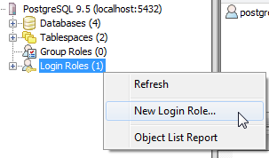

<!--
[Second page]({{ site.baseurl }}/second-page).
-->

* TOC
{:toc}

What is Logshark?
==================

Logshark lets you analyze your Tableau logs – in Tableau! Logshark is a tool you can use to analyze and troubleshoot Tableau performance and activity. Logshark extracts data from Tableau Server and Tableau Desktop log files and builds workbooks that can help you identify and understand error conditions, performance bottlenecks, and background activity. Logshark works by running a set of targeted plugins that pull specific data out of the log files. Logshark builds a data source and provides Tableau workbooks which you can then use to analyze the log files in Tableau.

Logshark and Tableau Technical Support 
=======================================

Logshark is made available AS-IS with **no** support from Tableau Technical Support. This is intended to be a self-service tool and includes this user guide. Any bugs discovered should be filed in the [Logshark Git Issue tracker](https://github.com/tableau/Logshark/issues).

Before you Begin
================

To install and run Logshark on your computer, review the following [System Requirements](#system-requirements) and [Tableau Archive Log Requirements](#tableau-archive-log-requirements).

System Requirements
-------------------

-   A computer running a 64-bit version of Windows (2008 R2 or later).

-   An account with local administrator permissions on the computer where you will be installing Logshark.

-   .NET Framework 4.5.1 installed (or later versions). The Logshark setup program checks for the correct version of the .NET Framework and automatically installs it if necessary.

-   For best performance, use a computer with the latest hardware and software available. The ability of Logshark to process log files improves as the performance of the computer's CPU, Memory and Disk I/O increases.

-   Tableau Desktop version 9.3 (or later) to view workbooks. You can download Tableau from: <http://www.tableau.com/products/desktop>

-   MongoDB – a standalone instance is included with the Logshark installation. Logshark uses MongoDB when it is extracting data from the log files. In most cases, you can specify a command option to tell Logshark to utilize the local instance of MongoDB for processing.

    -   However, if you have large log files (greater than 2 GB) the recommendation is that you use a MongoDB instance located on another computer to minimize contention.

    -   You can Download MongoDB Community Server at: <https://www.mongodb.com/download-center#community>. To configure it, see [Use your own MongoDB instance.](#use-your-own-mongodb-instance)

-   PostgreSQL – Logshark requires a PostgreSQL database as the backing data source for the workbooks that analyze the Tableau log files. PostgreSQL is not included in the Logshark installation. To use Logshark, you need to download and install PostgreSQL (version 9.5 or later) on your computer. <https://www.postgresql.org/>. As with MongoDB, for best performance on very large log files, we recommend that you install PostgreSQL on a separate computer.

    -   **NOTE:** Do **NOT** use your Tableau Server repository for Logshark or any other existing PostgreSQL instance. Logshark needs to have its own PostgreSQL to store data.

Tableau Archive Log Requirements
--------------------------------

The archive log files must be from Tableau Server or Tableau Desktop version 9.0 or later. Logshark requires that the Tableau Server log files that you process are compressed (zipped) files, also known as *archive* files or *snapshots*.

You can create these archive files using the ‘**tabadmin ziplogs’** command on the Tableau Server, or by creating a snapshot from the Status or Maintenance menu within Tableau Server. For more information about gathering Tableau Server log files, see [Archive Log Files](http://onlinehelp.tableau.com/current/server/en-us/logs_create.htm).

For Tableau Desktop, the log files are located in the **My Tableau Repository** directory. The default location is \\**Users\\&lt;*username*&gt;\\Documents\\My Tableau Repository\\Logs**. You can also find the location using Tableau. Start Tableau Desktop and click **File &gt; Repository** **Location**.

After you locate the log files, you can copy them to another location to process, or specify the path to their current location when you run Logshark.

Install and Configure PostgreSQL
================================

Use the following instructions to manually install PostgreSQL on your computer. Logshark needs to have its own PostgreSQL instance to store data. If you are using PostgreSQL on a remote computer, that is, not on the local computer running Logshark, you need to do a few additional steps to allow the remote connection. By default, PostgreSQL does not allow any remote connections.

Download and Install PostgreSQL
-------------------------------

-   Download PostgreSQL
    [http://www.enterprisedb.com/products-services-training/pgdownload\#bwindows](http://www.enterprisedb.com/products-services-training/pgdownload)

-   Run the installer and configure the following options into the setup wizard:

    -   For the (**postgres**) superuser password: &lt;*your choice&gt;*

    -   Port: **5432**

    -   Locale: English, United States

    -   If prompted to launch StackBuilder, choose **No**.

Configure PostgreSQL for Logshark
---------------------------------

The following instructions describe how to configure your PostgreSQL installation for Logshark.

### Create a Login Role for Logshark

1.  Open pgAdmin (III or 4), the PostgreSQL administration tool.

2.  Connect to the PostgreSQL server using the superuser (**postgres**) login account.

3.  Right click on **Login Roles** (or Login/Group Role) and choose **New Login Role…**

1.  In the New Login Role dialog box, enter the following values:
    Role name: **logshark**
    Password: **logshark** (on the Definition tab).

    Role privileges: Select the “**Can create databases**” and ‘**Can login**’ options.

2.  (Optional) If you installed PostgreSQL on a remote computer (not on the computer running Logshark), you need to add a pg\_hba.conf entry to enable a connection. See instructions for this at [https://www.postgresql.org/docs/current/static/auth-pg-hba-conf.html.
    ](https://www.postgresql.org/docs/current/static/auth-pg-hba-conf.html.)

Install Logshark 
=================

If you have not done so already, you need to run the Logshark Setup program. If you need to uninstall or re-install Logshark, you should follow the [Uninstall Logshark](#uninstall-logshark) instructions.

Run the Logshark Setup program
------------------------------

1.  From the directory where you downloaded Logshark, run the Logshark Setup program, double-click the file ‘Setup\_Logshark\_v1.0.exe’.

2.  Click **Install** to use the default configuration. This adds Logshark to the PATH environment variable.

-   Click "Options" if you need to change the default installation directory (from C:\\Program Files\\Logshark).

**NOTE:** The archive logs will need to be unzipped or copied to the drive where you have installed Logshark. If your ‘C’ drive is low on space, you should install Logshark in a different location.

Configure Logshark 
===================

Logshark uses a configuration file to point to the databases that are used for parsing and storing log data. The configuration file also lets you publish the Tableau workbooks to a specific Tableau Server. This configuration is located at &lt;*install\_directory&gt;*\\Config\\Logshark.config.

Some of these configuration settings can be overridden at the command line. Other settings can only be set in the configuration file. For example, if you want to specify which Tableau Server to use when publishing workbooks, you need to set that option in the configuration file.

**NOTE:** To be able to publish workbooks to Tableau Server, the REST API option (*‘api.server.enabled’*) must be enabled. See the [REST API Requirements](https://onlinehelp.tableau.com/current/api/rest_api/en-us/help.htm#REST/rest_api_requ.htm%3FTocPath%3D_____3) article for more details.

Edit the PostgreSQL connection information in Logshark.config
-------------------------------------------------------------

1.  In a text editor, open the configuration file: &lt;*install\_directory&gt;*\\Config\\Logshark.config file. In the Logshark.config file, change the &lt;PostgresConnection&gt; settings to match your PostgreSQL setup.

2.  Set the **Server address** attribute to the name of the computer that is running PostgreSQL. For example, if you have installed PostgreSQL on your local computer, use **localhost** as the Server address.

3.  Set the **port** attribute to the port your server uses if it is different from the default. The default port is **5432**.

4.  For the user, set both the **username** and password to **logshark** to match the role/user and password you added when you [Configure PostgreSQL for Logshark](#configure-postgresql-for-logshark).

<table>
<thead>
<tr class="header">
<th>
...

<strong>  &lt;PostgresConnection&gt;</strong> 
<strong>    &lt;Server address=&quot;localhost&quot; port=&quot;5432&quot;/&gt;</strong> 
<strong>    &lt;User username=&quot;logshark&quot; password=&quot;logshark&quot;/&gt;</strong> 
<strong>  &lt;/PostgresConnection&gt;</strong> 
...
</th>
</tr>
</thead>
<tbody>
</tbody>
</table>

1.  Save the file.

    **NOTE:** You only need to edit the MongoDB connection information if you plan to use your own MongoDB installation to store the log data (recommended if logs are greater than 2GB). In most cases, you want to use the MongoDB instance that Logshark provides (using the **--startlocalmongo** command line option, or by setting **LocalMongoOptions useAlways=”true”** in the config). For more information, see [Use your own MongoDB instance](#use-your-own-mongodb-instance).

Edit the Tableau Server connection information in Logshark.config
-----------------------------------------------------------------

> If you want to publish the workbooks that Logshark generates on Tableau Server, change the &lt;TableauConnection&gt; settings in the Logshark.config file to match your Tableau Server configuration.
>
> When you edit the Tableau Server connection, follow these guidelines:

-   The ‘Server address’ attribute should just contain the hostname or IP address of the computer (*for example, mytableauserver.tableau.com*), and should not be prefixed with the protocol (*http or https*).

-   When using a non-standard port for your Tableau Server, ensure the ‘port’ attribute is set correctly (*for example, ‘http’ has port=80, and ‘https’ has port=443*).

-   The ‘site’ attribute cannot be blank. If you are using the default site *(for example, URL: http://localhost/\#)*, specify "Default" as the name (*site="Default"*).

-   To publish workbooks, the user account you specify must exist on the Tableau Server (and the site) with Publisher permissions and the permissions to create projects. (*Site Administrator role will be the easiest option*).

<table>
<thead>
<tr class="header">
<th><blockquote>

...

</blockquote>

<strong>&lt;TableauConnection protocol=&quot;http&quot;&gt;</strong> 
<strong>    &lt;Server address=&quot;myTableauServer&quot; port=&quot;80&quot; site=&quot;MySite&quot;/&gt;</strong> 
<strong>    &lt;User username=&quot;myUser&quot; password=&quot;myUserPassword&quot;/&gt;</strong> 
<strong>&lt;/TableauConnection&gt;</strong> 
...
</th>
</tr>
</thead>
<tbody>
</tbody>
</table>

Running Logshark and Viewing the Results
========================================

After you set up PostgreSQL and install and configure Logshark, the rest is easy.

Run Logshark to process the log files
-------------------------------------

1.  Open a Command Prompt window as administrator.

2.  Run ‘Setup\_Logshark\_v1.0.exe’ and specify the path to the Tableau archive and any other option you wish to set. Logshark uses the following syntax:
    **logshark** \[*target*\] \[*options*\]
    Where \[*target*\] represents a zipped archive file (logs.zip), directory, or hash value from a previous run. Logshark supports both absolute and relative paths.
    One option that you will likely use is **--startlocalmongo**, unless you are using your own MongoDB instance in place of the one Logshark provides.
    To see all the Logshark command options and syntax, use the **--help** option.
    **logshark --help**

**
**

**Examples:**

The following example runs Logshark on the archive file, logs.zip and uses the local MongoDB that Logshark provides. Results are available in the &lt;Logshark\_install\_location&gt;\\Output directory.

**logshark C:\\Logs\\logs.zip --startlocalmongo**

The following command directs Logshark to process logs on a file share, and uses the *-p option* to publish the generated workbooks in the default Tableau Server location.

**logshark \\\\workgroup\\Files\\Home\\Shared\\logs.zip -p --startlocalmongo**

For more information, see the [Logshark command options](#logshark-command-options).

View the generated Tableau workbooks:
-------------------------------------

-   All workbooks (or other plugin-generated content) are saved in the following directory:

&lt;Logshark\_install\_location&gt;\\Output

You can also click **Start** &gt; **All Programs** &gt; **Logshark** &gt; **Logshark** **Output**

-   If you want to publish the workbooks to Tableau Server using the ***-p option***, the workbooks are published on the Tableau Server you specify in the Logshark.config file. See [Edit the Tableau Server connection information in Logshark.config](#edit-the-tableau-server-connection-information-in-logshark.config). The URL for your workbooks would look like the following: http://&lt;yourServer&gt;/\#/site/&lt;yourSite&gt;/projects.
    The format of a project is &lt;Host\_Name&gt;\_DATETIME\_Filename, where &lt;Host\_Name&gt; is the name of the computer where Logshark was run. The project contains all the workbooks for the archive file.

Remove Logshark Installation
============================

Logshark can be removed by simply running the Logshark setup program. Temporary files, logs and workbooks generated by Logshark are left behind and must be manually deleted.

Uninstall Logshark
------------------

-   If you want to remove Logshark from your computer, run the Logshark Setup program (‘Setup\_Logshark\_v1.0.exe’), and then click **Uninstall** from the Logshark Setup dialog box.
    You can also go to the Control Panel &gt; Uninstall to remove or change a program.

Remove PostgreSQL files.
------------------------

-   If you want to remove PostgreSQL from your computer, go to Control Panel &gt; Uninstall or change a program and right-click your PostgreSQL program and choose **Uninstall**.

-   Delete the data folder from PostgreSQL installation directory (for example, C:\\Windows\\Program Files\\PostgreSQL\\9.5\\data).

Logshark Reference
==================

This section provides more information about the Logshark command and configuration options you can use to customize Logshark for your specific needs and environment.

Logshark command options
------------------------

Full usage can be viewed at any time by invoking **logshark --help**.  The only required argument is the target, which can be either an archive (zip file), a directory, or a logset hash. A logset is a set of log files that you process at one time with Logshark. Logshark generates a hash value (checksum) for each set of logs that gets processed.

**Logshark command syntax**

| logshark \[TARGET\] \[OPTIONS\]… |
|----------------------------------|

**\[TARGET\]**

Target can be a zip file, a hash value (from a previous Logshark run), or the path and name of a directory.

 

<table>
<thead>
<tr class="header">
<th><h2 id="options">[OPTIONS]</h2></th>
<th><h2 id="description">Description</h2></th>
</tr>
</thead>
<tbody>
<tr class="odd">
<td>--args [&quot;arg1”] ...</td>
<td>
Set of custom arguments that will be passed to plugins. For example,

logshark --args &quot;PluginName.MyCustomArg:MyValue&quot; ...
</td>
</tr>
<tr class="even">
<td>--dbname &lt;name&gt;</td>
<td>Sets a custom name for the database instance where plugin output is stored. If not specified, a new instance will be generated. The default behavior is to generate a new database for each run. If a name is specified and the given database name already exists, the data generated by this run will be appended to it.</td>
</tr>
<tr class="odd">
<td>-d, --dropparsedlogset</td>
<td>(Default: False) Drops the parsed logset from MongoDB at the end of the run. Logsets parsed by previous runs will be ignored.</td>
</tr>
<tr class="even">
<td>-f, --forceparse</td>
<td>(Default: False) Forces a fresh parse of the logset, overriding any existing data in MongoDB.</td>
</tr>
<tr class="odd">
<td>--listplugins</td>
<td>Lists information about all available Logshark plugins.</td>
</tr>
<tr class="even">
<td>--localmongoport &lt;port&gt;</td>
<td>(Default: 27017) Port which the temporary local MongoDB process will run on.</td>
</tr>
<tr class="odd">
<td>--metadata [&quot;key:value”] ...</td>
<td>
Set of custom metadata key/value pairs that will stored in the resulting Mongo database. For example,

logshark ... --metadata &quot;SalesforceId:SomeValue TFSDefect:SomeOtherValue&quot; ...
</td>
</tr>
<tr class="even">
<td>
--plugins all | default | none | &lt;plugin&gt;

--plugins &quot;&lt;plugin1&gt; &lt;plugin2&gt; ...&quot;
</td>
<td>(Default: default) Specifies the plugin (or list of plugins) to run against the processed log set. Also accepts &quot;all&quot; to run all plugins, or &quot;none&quot; to bypass plugin execution. To specify more than one plugin, separate the name of each plugin with a space, and enclose the list in quotation marks. See <a href="#logshark-plugins-and-generated-workbooks">Logshark plugins and generated workbooks</a>.</td>
</tr>
<tr class="odd">
<td>--parseall</td>
<td>(Default: False) Parse full logset into MongoDB. If false, only the logs required for active plugins will be parsed.</td>
</tr>
<tr class="even">
<td>-p, 
--publishworkbooks </td>
<td>(Default: False) Publish resulting workbooks to Tableau Server.</td>
</tr>
<tr class="odd">
<td>--projectdescription</td>
<td>Sets the Tableau Server project description where any workbooks will be published.</td>
</tr>
<tr class="even">
<td>--projectname &lt;project&gt;</td>
<td>Sets the Tableau Server project name where any workbooks will be published.</td>
</tr>
<tr class="odd">
<td>-s, --startlocalmongo </td>
<td>(Default: False) Start up a temporary local MongoDB process for this run. Recommended for small log sets only, that is, smaller than 2 GB</td>
</tr>
<tr class="even">
<td>--sitename &lt;site&gt;</td>
<td>Sets the name of the Tableau Server site where any workbooks will be published. This site must already exist and the user specified in Logshark.config must have permissions to publish and create projects in it. This value overrides the Site value specified in Logshark.config.</td>
</tr>
<tr class="odd">
<td>--tags</td>
<td>List of tags that will written to the resulting workbook(s). 
For example: --tags &quot;MyTag MyOtherTag&quot;</td>
</tr>
<tr class="even">
<td>--help</td>
<td>Display Logshark command help.</td>
</tr>
</tbody>
</table>

Logshark plugins and generated workbooks
----------------------------------------

The following table shows the list of available Logshark plugins and the names of the workbooks that the plugins generate. Specify the name of the plugin with the Logshark **--plugins** option. To specify more than one plugin, use spaces to separate the plugins and enclose the list in quotation marks (" ").

**Usage:**

> **logshark** \[TARGET\] **--plugins** &lt;*plugin*&gt;
>
> **logshark** \[TARGET\] **--plugins** **"**&lt;*plugin1&gt; &lt;plugin2&gt; &lt;plugin3&gt; ...**"***

**Examples:**

> **logshark logs.zip --plugins Apache**
>
> **logshark logs.zip --plugins "Apache VizqlServer" **

 

| Plugin name            
 -----------             | Workbook                                     
                          --------                                      | Description                                                                                                                                                                                                                                                                                                                     
                                                                         -----------                                                                                                                                                                                                                                                                                                                      |
|------------------------|----------------------------------------------|---------------------------------------------------------------------------------------------------------------------------------------------------------------------------------------------------------------------------------------------------------------------------------------------------------------------------------|
| Apache                 | Apache.twb                                   | Collect and analyze workbook statistics on Tableau Server from the Apache (http) log files, including viz load times, view counts, errors, and warnings.                                                                                                                                                                        |
| Backgrounder           | Backgrounder.twb                             | Displays information about Tableau Server background tasks and jobs, such as subscriptions and extract refreshes. Data is taken from the backgrounder log files.                                                                                                                                                                |
| ClusterController      | ClusterController.twb                        | Displays information about Tableau Server Cluster Controller events and errors, taken from the clustercontroller & zookeeper log files. Also includes some information about disk performance.                                                                                                                                  |
| Config                 | Config.twb                                   | Displays the Tableau Server topology and configuration settings from the log files.                                                                                                                                                                                                                                             |
| CustomWorkbooks        | Any custom user workbooks in CustomWorkbooks | Allows a user to output their own custom workbooks as a part of a Logshark run. These workbooks are loaded from the CustomWorkbooks\\ folder. Plugin dependencies for each workbook can specified in CustomWorkbookConfig.xml. For more information, see [Adding your own custom workbooks](#adding-your-own-custom-workbooks). |
| Netstat                | Netstat.twb                                  | Displays information about transport-layer port reservations taken from the Netstat output files in a Server logset. The ziplogs must have been taken with the **–n** argument in order to contain Netstat data.                                                                                                                |
| ResourceManager        | ResourceManager.twb                          | Shows information harvested from the Server Resource Manager log events. Workbook includes metrics on CPU utilization, memory utilization, and process recycling events.                                                                                                                                                        |
| Tabadmin               | Tabadmin.twb                                 | Displays Tableau Server admin (tabadmin) activities from the log files, including Tableau Server starts, stops, backup, and error history.                                                                                                                                                                                      |
| VizqlDesktop           | VizqlDesktop.twb                             | Collect and analyze events from Tableau Desktop vizql log files, including Vizql events, query activity, and errors.                                                                                                                                                                                                            |
| VizqlServer            | VizqlServer.twb                              | Collects high-level session summary information from Tableau vizqlserver log files, including error data.                                                                                                                                                                                                                       |
| VizqlServerPerformance | VizqlServerPerformance.twb                   | Collect and analyze all events from Tableau Server vizqlserver log files, including detailed performance information.                                                                                                                                                                                                           |

Adding your own custom workbooks
--------------------------------

Logshark provides an option to include your own custom workbooks in a Logshark run.  These workbooks will then be included in the run output if the CustomWorkbooks plugin is run and all of their dependencies are met.

To configure this, first browse to your Logshark installation directory and open up the "CustomWorkbooks" folder.  This is where any custom workbook (.twb) files should be placed.  Additionally, you will need to edit CustomWorkbookConfig.xml and add an entry for your custom workbook. For example:

| **&lt;!—Custom Tableau workbooks can be placed alongside this config and they will be output at runtime if their dependencies are met.** 
                                                                                                                                           
 **Plugin dependencies must be declared for any plugins that generate a table that the custom workbook relies on.**                        
                                                                                                                                           
 **To get a list of eligible plugin dependency names, invoke Logshark with the "listplugins" command line flag.--!&gt;**                   
                                                                                                                                           
 **&lt;CustomWorkbooks&gt;**                                                                                                               
                                                                                                                                           
 **&lt;Workbook name="** **MyCustomApacheAndBackgrounderWorkbook.twb"&gt;**                                                                
                                                                                                                                           
 **&lt;PluginDependency name="Apache" /&gt;**                                                                                              
                                                                                                                                           
 **&lt;PluginDependency name="Backgrounder" /&gt;**                                                                                        
                                                                                                                                           
 **&lt;/Workbook&gt;**                                                                                                                     
                                                                                                                                           
 **&lt;/CustomWorkbooks&gt;**                                                                                                              |
|------------------------------------------------------------------------------------------------------------------------------------------|

This entry will cause the file "MyCustomApacheAndBackgrounderWorkbook.twb" to be output at the Logshark run with the appropriate data sources substituted.  NOTE: The "PluginDependency" entries in the example above will make it so that the workbook will only be output if both the Apache and Backgrounder plugins run successfully.  You can declare multiple plugin dependencies for a single workbook, so that you can include workbooks that join the output tables of multiple plugins.

Appending Logshark-generated data to the same workbook 
-------------------------------------------------------

When you run Logshark using the default command options, Logshark generates a new PostgreSQL database for each run. If you want to append data to the same database, so that the data will all be available in the same workbook, you can specify the name of the database on the command line, using the --dbname &lt;database&gt; option. You can use this option to set a custom name for the database where the plugin output is stored (the data source for the plugin workbook).

logshark C:\\Logs\\logs.zip --plugins Apache --dbname myApacheData

If the –-dbname option is not specified, a new database will be generated.

Use your own MongoDB instance
-----------------------------

If you have log files that are larger than 2 GB, you should install and set up your own MongoDB Community server. Download it from [https://www.mongodb.com/download-center\#community.
](https://www.mongodb.com/download-center)

If you install your own MongoDB, you must configure Logshark to use your MongoDB instance by editing the Logshark configuration file, &lt;Logshark\_install\_location&gt;\\config\\Logshark.config.

The Logshark.config file contains the &lt;MongoConnection&gt; element that sets the options for the MongoDB that Logshark uses to store the BSON documents extracted from the archive (zipped logs).

<table>
<thead>
<tr class="header">
<th>  &lt;MongoConnection poolSize=&quot;200&quot; timeout=&quot;60&quot; insertionRetries=&quot;3&quot;&gt; 
    &lt;Server address=&quot;logshark-mongo-prod&quot; port=&quot;27000&quot;/&gt; 
    &lt;User username=&quot;logshark&quot; password=&quot;logshark&quot;/&gt; 
  &lt;/MongoConnection&gt;</th>
</tr>
</thead>
<tbody>
</tbody>
</table>

If you want to use a different MongoDB, change the setting for server address and port to match the new database:

**&lt;Server address=**"myMongodb\_server" **port=**"27017"**/&gt;**
Set the user name and password, if necessary, or leave blank:

&lt;**User username**="" **password**=""**/&gt;**

The MongoConnection element has attributes that describe the connection properties. These attributes are:

**poolSize=**"&lt;size&gt;"** **

Sets the maximum connection pool size for concurrent connections to MongoDB.  Most people will never come close to reaching the default limit of 200. If you experience problems with having too many concurrent connections open against the MongoDB, you might want to try lowering this value.
**timeout=**"&lt;seconds&gt;" 
Specifies the maximum time to wait when the client is establishing a new connection to MongoDB.  In most cases, you won't want to change this, as the default setting of 30 seconds should allow plenty of time. 
**insertionRetries=**"&lt;n&gt;"

Specifies the number of times a failed insertion to MongoDB will be retried.  Retries are costly operations so this probably shouldn't ever be set higher than the default ("3").
